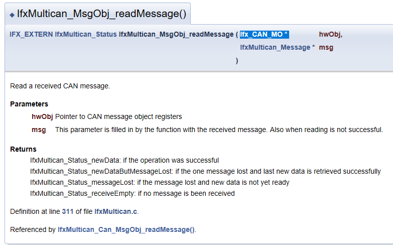
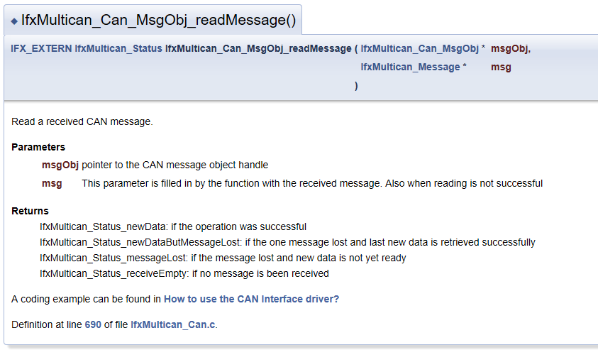
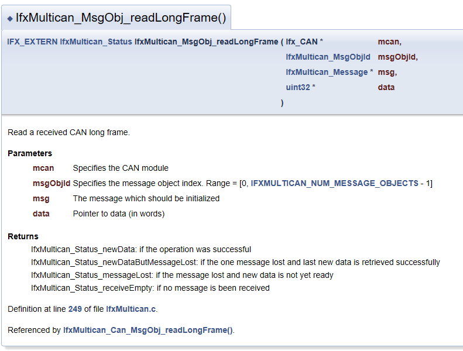
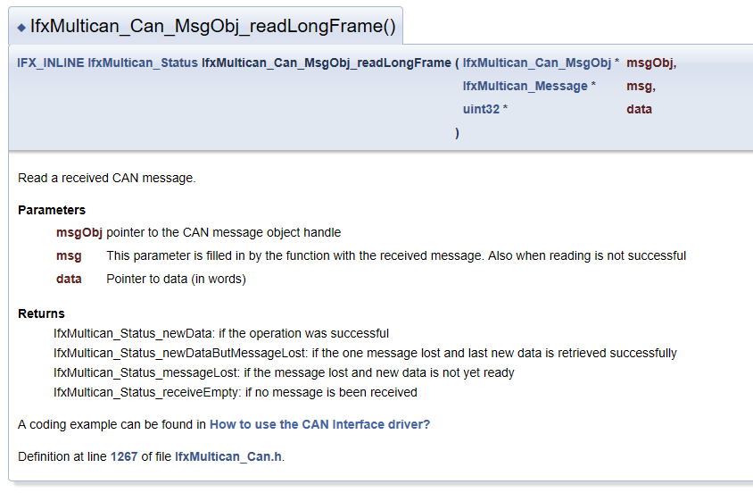

# 2. The First Journey
Communication with CAN

## 2.1. CAN Communication using TC275 Lite Kit

AURIX Development Studio 에 있는 CAN example 을 사용해서 실제 CAN 통신을 해 볼 것이다.

### 2.1.1. 준비사항 
1. Windows 10 컴퓨터(노트북)
2. AURIX Development Studio - [how-to-setup](2024-03-14-HowToSetUpAURIXDevelopmentStudio.html)
3. TC275 Lite Kit & User Manual [link](https://www.infineon.com/dgdl/Infineon-AURIX_TC275_Lite_Kit-UserManual-v01_02-EN.pdf?fileId=5546d46272e49d2a017305871f9464ab)
4. TC27x User Manaul [link](https://www.infineon.com/dgdl/Infineon-TC27x_D-step-UM-v02_02-EN.pdf?fileId=5546d46269bda8df0169ca09b44623ed)
5. TC27x Data Sheet [link](https://www.infineon.com/dgdl/Infineon-TC27xDC-DataSheet-v01_00-EN.pdf?fileId=5546d462694c98b4016953972c57046a)
6. TC275 iLLD User Manual [link](https://www.infineon.com/cms/en/product/gated-document/tc27d-illd-um-1-0-1-16-0-8ac78c8c8779172a0187e6944d6c160b/)

## 2.2. Analysis of the examples

[AURIX Expert Training](https://www.infineon.com/cms/en/product/promopages/aurix-expert-training/)

Example

### 2.2.1. MULTICAN
MULTICAN_1_KIT_TC275_LK-TR ([Link](https://www.infineon.com/dgdl/Infineon-AURIX_MULTICAN_1_KIT_TC275_LK-TR-Training-v01_00-EN.pdf?fileId=5546d4627a0b0c7b017a5868238f4cba))

- TC275 Lite Kit에 CAN Node를 두 개 만들고, 루프백 모드를 사용해서 서로 통신한다.
- 예제 동작
  1. Node 0 sends data to Node 1
  2. if the transmission is successful, an interrupt service routine occurs that turns on LED1. 
  3. Node 1 receives data from Node 0
  4. if reception is successful, an interrupt service routine occurs. The ISR compares the tx data and rx data and turn on LED2 if they are equal

#### 2.2.1.1. core0_main

<details>
<summary><strong>Source Code(Click)</strong></summary>
<div markdown="1">

```c
int core0_main(void)
{
    IfxCpu_enableInterrupts();

    /* !!WATCHDOG0 AND SAFETY WATCHDOG ARE DISABLED HERE!!
     * Enable the watchdogs and service them periodically if it is required
     */
    IfxScuWdt_disableCpuWatchdog(IfxScuWdt_getCpuWatchdogPassword());
    IfxScuWdt_disableSafetyWatchdog(IfxScuWdt_getSafetyWatchdogPassword());

    /* Wait for CPU sync event */
    IfxCpu_emitEvent(&g_cpuSyncEvent);
    IfxCpu_waitEvent(&g_cpuSyncEvent, 1);

    /* Application code: initialization of MULTICAN, LEDs and the transmission of the CAN message */
    initMultican();
    initLed();
    transmitCanMessage();

    while(1)
    {
    }
    return (1);
}
```
</div>
</details>

- 전역 인터럽트 활성화 - CAN TX, RX 될때 Interrupt Service Routine을 사용해야하므로 인터럽트를 활성화한다.
- WDG 비활성화 - 추후 작성
  - cpu WDG
  - Safety WDG
- Core 동기화
  - core0, core1, core2 모두 emit할때까지 기다리고 동기화가 맞춰지면 이후 코드 실행하는 듯 하다. 
- CAN 예제 구동시 필요한 코드
  - CAN 모듈 초기화
  - LED 모듈 초기화
  - 메세지 전송
- (꺼지지 않도록) 무한 루프


#### 2.2.1.2. Initialize MultiCAN Module

<details>
<summary><strong>Source Code(Click)</strong></summary>
<div markdown="1">

```c
// 주석 부분 일정 생략
void initMultican(void)
{
    /* ==========================================================================================
     * CAN module configuration and initialization:
     * ==========================================================================================
     */
    IfxMultican_Can_initModuleConfig(&g_multican.canConfig, &MODULE_CAN);

    g_multican.canConfig.nodePointer[TX_INTERRUPT_SRC_ID].priority = ISR_PRIORITY_CAN_TX;
    g_multican.canConfig.nodePointer[RX_INTERRUPT_SRC_ID].priority = ISR_PRIORITY_CAN_RX;

    IfxMultican_Can_initModule(&g_multican.can, &g_multican.canConfig);

    /* ==========================================================================================
     * Source CAN node configuration and initialization:
     * ==========================================================================================
     */
    IfxMultican_Can_Node_initConfig(&g_multican.canNodeConfig, &g_multican.can);

    g_multican.canNodeConfig.loopBackMode = TRUE;
    g_multican.canNodeConfig.nodeId = IfxMultican_NodeId_0;

    IfxMultican_Can_Node_init(&g_multican.canSrcNode, &g_multican.canNodeConfig);

    /* ==========================================================================================
     * Destination CAN node configuration and initialization:
     * ==========================================================================================
     */
    IfxMultican_Can_Node_initConfig(&g_multican.canNodeConfig, &g_multican.can);

    g_multican.canNodeConfig.loopBackMode = TRUE;
    g_multican.canNodeConfig.nodeId = IfxMultican_NodeId_1;

    IfxMultican_Can_Node_init(&g_multican.canDstNode, &g_multican.canNodeConfig);

    /* ==========================================================================================
     * Source message object configuration and initialization:
     * ==========================================================================================
     */
    IfxMultican_Can_MsgObj_initConfig(&g_multican.canMsgObjConfig, &g_multican.canSrcNode);

    g_multican.canMsgObjConfig.msgObjId = SRC_MESSAGE_OBJECT_ID;
    g_multican.canMsgObjConfig.messageId = CAN_MESSAGE_ID;
    g_multican.canMsgObjConfig.frame = IfxMultican_Frame_transmit;
    g_multican.canMsgObjConfig.txInterrupt.enabled = TRUE;
    g_multican.canMsgObjConfig.txInterrupt.srcId = TX_INTERRUPT_SRC_ID;

    IfxMultican_Can_MsgObj_init(&g_multican.canSrcMsgObj, &g_multican.canMsgObjConfig);

    /* ==========================================================================================
     * Destination message object configuration and initialization:
     * ==========================================================================================
     */
    IfxMultican_Can_MsgObj_initConfig(&g_multican.canMsgObjConfig, &g_multican.canDstNode);

    g_multican.canMsgObjConfig.msgObjId = DST_MESSAGE_OBJECT_ID;
    g_multican.canMsgObjConfig.messageId = CAN_MESSAGE_ID;
    g_multican.canMsgObjConfig.frame = IfxMultican_Frame_receive;
    g_multican.canMsgObjConfig.rxInterrupt.enabled = TRUE;
    g_multican.canMsgObjConfig.rxInterrupt.srcId = RX_INTERRUPT_SRC_ID;

    IfxMultican_Can_MsgObj_init(&g_multican.canDstMsgObj, &g_multican.canMsgObjConfig);
}
``` 
</div>
</details>

아래 함수는 각각 기존 디폴트 값에 user config값을 업데이트하기 위한 함수이다. 
- CAN module configuration and initialization
  - IfxMultican_Can_initModuleConfig
  - IfxMultican_Can_initModule
  - 여기선 CAN node의 인터럽트 우선순위를 설정한다.
- Source/Destination CAN node configuration and initialization
  - IfxMultican_Can_Node_initConfig 
  - IfxMultican_Can_Node_init
  - 여기선 각 CAN node의 루프백 모드와 실제 node ID(src: node0, dst: node1)를 설정한다.
- Source/Destination message object configuration and initialization
  - IfxMultican_Can_MsgObj_initConfig 
  - IfxMultican_Can_MsgObj_init
  - 여기선 Message Object 와 관련된 설정을 한다.
    - Message Object ID 정의
    - Arbitration 단계에서 사용되는 CAN 메시지 ID 정의
    - 메시지 객체 타입 정의(Tx/Rx) 
    - 인터럽트 생성 활성화(Tx와 Rx의 인터럽트 노드 포인터는 달라야함)

위의 함수들은 다음과 같은 순서를 통해 업데이트한다.
1. IfxMultican_Can_**init*Config** 함수를 통해 구조체를 초기화하고 해당 모듈의 기본 설정값을 가져온다(load).
2. 설정 값을 수정한다. (modify)
3. IfxMultican_Can_**init*** 함수를 통해 변경된 설정 값으로 실제 초기화한다(initialize).
   - 해당 API를 살펴보면 어떤 레지스터가 바뀌는지 파악할 수 있다. 

ex) Can Node1에 대해서 초기화하는 과정을 살략보면 다음과 같다.
1. CAN Node 구조체(`&g_multican.canNodeConfig`)를 초기화하고 내부에서 아래를 포함한 값으로 초기화 한다. (이후는 길어서 생략)
   - `Can_Node_initConfig(&g_multican.canNodeConfig, &g_multican.can)` 
     - `config->module = mcan->mcan;`
     - `config->nodeId = IfxMultican_NodeId_0;`
     - `config->loopBackMode = FALSE;`
2. 설정 값을 수정한다.
   - 해당 노드는 루프백 모드를 사용하고 destination으로 사용할 노드이므로 아래처럼 수정한다. 
   - `g_multican.canNodeConfig.loopBackMode = TRUE;`
   - `g_multican.canNodeConfig.nodeId = IfxMultican_NodeId_1;`
3. 수정한 값(`&g_multican.canNodeConfig`)으로 실제 노드(`&g_multican.canDstNode`)를 업데이트한다.
   - `Can_Node_init(&g_multican.canDstNode, &g_multican.canNodeConfig)`  
   - 여기서 실제 레지스터 값을 변경한다.


#### 2.2.1.3. Initialize LED Modele
<details>
<summary><strong>Source Code(Click)</strong></summary>
<div markdown="1">

```c
void initLed(void)
{
    /* ======================================================================
     * Configuration of the pins connected to the LEDs:
     * ======================================================================
     */
    g_led.led1.port      = &MODULE_P00;
    g_led.led1.pinIndex  = PIN5;
    g_led.led1.mode      = IfxPort_OutputIdx_general;
    g_led.led1.padDriver = IfxPort_PadDriver_cmosAutomotiveSpeed1;

    g_led.led2.port      = &MODULE_P00;
    g_led.led2.pinIndex  = PIN6;
    g_led.led2.mode      = IfxPort_OutputIdx_general;
    g_led.led2.padDriver = IfxPort_PadDriver_cmosAutomotiveSpeed1;

    /* Initialize the pins connected to LEDs to level "HIGH"; will keep the LEDs turned off as default state */
    IfxPort_setPinHigh(g_led.led1.port, g_led.led1.pinIndex);
    IfxPort_setPinHigh(g_led.led2.port, g_led.led2.pinIndex);

    /* Set the pin input/output mode for both pins connected to the LEDs */
    IfxPort_setPinModeOutput(g_led.led1.port, g_led.led1.pinIndex, IfxPort_OutputMode_pushPull, g_led.led1.mode);
    IfxPort_setPinModeOutput(g_led.led2.port, g_led.led2.pinIndex, IfxPort_OutputMode_pushPull, g_led.led2.mode);

    /* Set the pad driver mode for both pins connected to the LEDs */
    IfxPort_setPinPadDriver(g_led.led1.port, g_led.led1.pinIndex, g_led.led1.padDriver);
    IfxPort_setPinPadDriver(g_led.led2.port, g_led.led2.pinIndex, g_led.led2.padDriver);
}
```
</div>
</details>

해당함수는 LED를 키고 끌 수 있도록 설정하기 위한 함수이다.
- AppLedType 인 전역변수 g_led를 생성하고 그 안에 LED1, LED2를 각각 설정한다.
   - LED1: P00.5, output, paddriver-cmos
   - LED2: P00.6, output, paddriver-cmos
   - 해당 핀들은 TC275 Lite Kit의 LED에 연결된 포트이다.
- 다음 함수들을 사용해서 LED를 초기화한다.
- IfxPort_setPinHigh 를 통해서 핀상태를 HIGH로 만든다.
   - TC275 LK의 LED의 기본 설정은 Active Low이므로 핀 상태를 HIGH만들어서 OFF 상태를 유지한다.
- IfxPort_setPinModeOutput 를 통해서 핀 모드를 설정한다.
   - output mode: LED와 연결되므로 GPIO는 Output으로 되어야함
   - push-pull mode: 내부 회로를 통해 출력을 결정함. 전원(VEXT)은 3.3V을 사용함
- IfxPort_setPinPadDriver 를통해서 핀의 pad driver를 설정한다.

<details>
<summary><strong>LED in EVB usermanual(Click)</strong></summary>
<div markdown="1">


</div>
</details>

#### 2.2.1.4. Transmit CAN Message
<details>
<summary><strong>Source Code(Click)</strong></summary>
<div markdown="1">

```c
/* Function to initialize both TX and RX messages with the default data values.
 * After initialization of the messages, the TX message will be transmitted.
 */
void transmitCanMessage(void)
{
    /* Define the content of the data to be transmitted */
    const uint32 dataLow  = 0xC0CAC01A;
    const uint32 dataHigh = 0xBA5EBA11;

    /* Invalidation of the RX message */
    IfxMultican_Message_init(&g_multican.rxMsg,
                             INVALID_ID_VALUE,
                             INVALID_DATA_VALUE,
                             INVALID_DATA_VALUE,
                             g_multican.canMsgObjConfig.control.messageLen);

    /* Initialization of the TX message */
    IfxMultican_Message_init(&g_multican.txMsg,
                             g_multican.canMsgObjConfig.messageId,
                             dataLow,
                             dataHigh,
                             g_multican.canMsgObjConfig.control.messageLen);

    /* Send the CAN message with the previously defined TX message content */
    while( IfxMultican_Status_notSentBusy ==
           IfxMultican_Can_MsgObj_sendMessage(&g_multican.canSrcMsgObj, &g_multican.txMsg) )
    {
    }
}
```
</div>
</details>

실제로 CAN 노드를 통해서 데이터를 보내는 함수이다.
- RX는 메세지를 받아야하므로 보낼 메세지가 아닌 값으로 초기화한다.
   - id: `0xFFFFFFFF`
   - data:`0xDEADBEEF`
- TX는 보낼 메세지로 초기화 한다.
   - messageId: `0x777`
   - dataLow: `0xC0CAC01A`(cocacola)
   - dataHigh: `0xBA5EBA11`(baseball)
- 아래 함수를 통해서 CAN 메세지를 보낸다
   - `IfxMultican_Can_MsgObj_sendMessage(&g_multican.canSrcMsgObj, &g_multican.txMsg)`
   - msg object를 확인해서 보낼 메세지가 있으면 메세지를 보낸다. 
   - 메세지를 보낼때까지(CAN BUS가 IDLE이 아니면) 송신을 계속 시도한다.


#### 2.2.1.5. Interrupt Service Routines for TX
<details>
<summary><strong>Source Code(Click)</strong></summary>
<div markdown="1">

```c
IFX_INTERRUPT(canIsrTxHandler, 0, ISR_PRIORITY_CAN_TX);

void canIsrTxHandler(void)
{
    /* Just to indicate that the CAN message has been transmitted by turning on LED1 */
    IfxPort_setPinLow(g_led.led1.port, g_led.led1.pinIndex);
}
```
</div>
</details>

송신부의 Interrupt handler이다.
- 데이터가 송신될때 인터럽트 루틴이 발생해서 해당 함수가 불린다.
- 인터럽트 서비스 루틴을 등록하기 위해선 다음 매크로를 사용한다.
   - `IFX_INTERRUPT(isr, vectabNum, priority)`
   - 해당 매크로는 
   - isr: 인터럽트가 생기면 불리는 콜백함수
   - vectabNum: Vector table number
   - priority: 우선순위
      - 인터럽트가 여러번 불릴 때 처리순서를 위한 우선순위
      - 같은 순위로 만들수 없으므로 조금더 중요한 걸 높이 올림
      - tx, rx의 우선순위는 tx를 높게 해놨음.
- 해당 핸들러가 불리면 GPIO 핀을 LOW로 내려서 LED1을 킴(active low)

#### 2.2.1.6. Interrupt Service Routines for RX
<details>
<summary><strong>Source Code(Click)</strong></summary>
<div markdown="1">

```c
IFX_INTERRUPT(canIsrRxHandler, 0, ISR_PRIORITY_CAN_RX);

void canIsrRxHandler(void)
{
    IfxMultican_Status readStatus;

    /* Read the received CAN message and store the status of the operation */
    readStatus = IfxMultican_Can_MsgObj_readMessage(&g_multican.canDstMsgObj, &g_multican.rxMsg);

    /* If no new data has been received, report an error */
    if( !( readStatus & IfxMultican_Status_newData ) )
    {
        while(1)
        {
        }
    }

    /* If new data has been received but with one message lost, report an error */
    if( readStatus == IfxMultican_Status_newDataButOneLost )
    {
        while(1)
        {
        }
    }

    /* Finally, check if the received data matches with the transmitted one */
    if( ( g_multican.rxMsg.data[0] == g_multican.txMsg.data[0] ) &&
        ( g_multican.rxMsg.data[1] == g_multican.txMsg.data[1] ) &&
        ( g_multican.rxMsg.id == g_multican.txMsg.id ) )
    {
        /* Turn on the LED2 to indicate correctness of the received message */
        IfxPort_setPinLow(g_led.led2.port, g_led.led2.pinIndex);
    }
}
```
</div>
</details>

수신부의 Interrupt handler이다.
- 메세지가 수신되면 해당 핸들러가 불리고 다음을 수행함
   - 수신된 메세지를 읽고 state를 저장함.
   - 해당 데이터가 새로운 데이터인지 메세지가 손실되었는지 확인함.
   - 정상 데이터라면 보낸 메세지와 받은 메세지가 같은지 확인하고 id도 같은지 확인함
   - 다 같은 경우에만 GPIO 핀을 LOW로 내려서 LED2을 킴(active low)
- 실제로도 cocacola, baseball이 나오는지 확인 **(결과 사진 필요)**

### 2.2.2. MULTICAN in Flexible Data-Rate
MULTICAN_FD_1_KIT_TC275_LK-TR ([Link](https://www.infineon.com/dgdl/Infineon-AURIX_MULTICAN_FD_1_KIT_TC275_LK-TR-Training-v01_00-EN.pdf?fileId=5546d4627a0b0c7b017a586832ba4cbd))

- TC275 Lite Kit에 CAN Node를 CANFD 모드로 두 개 만들고, 루프백 모드를 사용해서 서로 통신한다. 
- 예제 동작
  1. Node 0 sends data to Node 1
  2. if the transmission and reception are successful, an interrupt is generated.
  3. In the interrupt service routine, read the reception data and compare tx, rx data. 
  4. If not errors detected, turn on LED

예제 "2.2.1.MULTICAN"과 겹치는 코드(비슷한 코드)는 스킵

#### 2.2.2.1. core0_main
<details>
<summary><strong>Source Code(Click)</strong></summary>
<div markdown="1">

```c

uint8 g_currentCanFdUseCase = 0;
IfxCpu_syncEvent g_cpuSyncEvent = 0;

int core0_main(void)
{
    /* skip, similar code  */

    /* Application code: initialization of MULTICAN, LED, transmission and verification of the CAN messages */
    initMultican();
    initLed();

    for(g_currentCanFdUseCase = 0; g_currentCanFdUseCase < NUMBER_OF_CAN_FD_CASES; g_currentCanFdUseCase++)
    {
        transmitCanMessage();
        verifyCanMessage();

        if(g_status != CanCommunicationStatus_Success)
        {
            break;
        }
    }

    /* If there was no error, turn on the LED to indicate correctness of the received messages */
    if(g_status == CanCommunicationStatus_Success)
    {
        IfxPort_setPinLow(g_led1.port, g_led1.pinIndex);
    }

    /* skip, similar code */
}
```
</div>
</details>

- 전역 인터럽트 활성화
- WDG 비활성화 
- Core 동기화
- CAN 예제 구동시 필요한 코드
  - CAN 모듈 초기화: CAN FD 설정
  - LED 모듈 초기화: LED1(pin00.5) 설정
  - 메세지 전송 및 검증(4회 반복)
  - 모든 메세지가 제대로 전송 된 경우 LED ON
- (꺼지지 않도록) 무한 루프

#### 2.2.2.2. Initialize MultiCAN Module
<details>
<summary><strong>Source Code(Click)</strong></summary>
<div markdown="1">

```c
#define STANDARD_MESSAGE_ID_1 0x444     /* Message ID that is used in arbitration phase */
#define STANDARD_MESSAGE_ID_2 0x777     /* Message ID that is used in arbitration phase */
#define EXTENDED_MESSAGE_ID_1 0x1234567 /* Message ID that is used in arbitration phase */
#define EXTENDED_MESSAGE_ID_2 0xAABBCCD /* Message ID that is used in arbitration phase */

const canMessageObjectConfigType    g_messageObjectConf[NUMBER_OF_CAN_FD_CASES] =
   {
      /* message ID / Extended Frame / message Length / Fast bitrate */
      { STANDARD_MESSAGE_ID_1, FALSE, IfxMultican_DataLengthCode_8,  FALSE },
      { EXTENDED_MESSAGE_ID_1, TRUE,  IfxMultican_DataLengthCode_8,  TRUE  },
      { STANDARD_MESSAGE_ID_2, FALSE, IfxMultican_DataLengthCode_32, FALSE },
      { EXTENDED_MESSAGE_ID_2, TRUE,  IfxMultican_DataLengthCode_64, TRUE  }
   };

void initMultican(void)
{
    uint8 currentCanMessageObject;
    /* ==========================================================================================
     * CAN module configuration and initialization:
     * ==========================================================================================
     */
    IfxMultican_Can_initModuleConfig(&g_multican.canConfig, &MODULE_CAN);

    g_multican.canConfig.nodePointer[RX_INTERRUPT_SRC_ID].priority = ISR_PRIORITY_CAN_RX;

    IfxMultican_Can_initModule(&g_multican.can, &g_multican.canConfig);

    /* ==========================================================================================
     * Common CAN node configuration and initialization:
     * ==========================================================================================
     */
    IfxMultican_Can_Node_initConfig(&g_multican.canNodeConfig, &g_multican.can);

    g_multican.canNodeConfig.loopBackMode = TRUE;
    g_multican.canNodeConfig.flexibleDataRate = TRUE;

    g_multican.canNodeConfig.fdConfig.nominalBaudrate = 500000;
    g_multican.canNodeConfig.fdConfig.nominalSamplePoint = 8000;
    g_multican.canNodeConfig.fdConfig.nominalSynchJumpWidth = 2000;
    g_multican.canNodeConfig.fdConfig.fastBaudrate = 2000000;
    g_multican.canNodeConfig.fdConfig.fastSamplePoint = 7000;
    g_multican.canNodeConfig.fdConfig.fastSynchJumpWidth = 2000;
    g_multican.canNodeConfig.fdConfig.loopDelayOffset = 0;

    /* ==========================================================================================
     * CAN node 0 configuration and initialization:
     * =========================================================================================
     */
    g_multican.canNodeConfig.nodeId = IfxMultican_NodeId_0;

    IfxMultican_Can_Node_init(&g_multican.canNode0, &g_multican.canNodeConfig);

    /* ==========================================================================================
     * CAN node 1 configuration and initialization:
     * ==========================================================================================
     */
    g_multican.canNodeConfig.nodeId = IfxMultican_NodeId_1;

    IfxMultican_Can_Node_init(&g_multican.canNode1, &g_multican.canNodeConfig);

    /* ==========================================================================================
     * Source standard message objects configuration and initialization:
     * ==========================================================================================
     * These CAN message objects are assigned to CAN Node 0
     * ==========================================================================================
     */
    IfxMultican_Can_MsgObj_initConfig(&g_multican.canMsgObjConfig, &g_multican.canNode0);

    g_multican.canMsgObjConfig.frame = IfxMultican_Frame_transmit;
    g_multican.canMsgObjConfig.control.matchingId = TRUE;

    for(currentCanMessageObject = 0; currentCanMessageObject < NUMBER_OF_CAN_FD_CASES; currentCanMessageObject++)
    {
        g_multican.canMsgObjConfig.msgObjId = (IfxMultican_MsgObjId)currentCanMessageObject;
        g_multican.canMsgObjConfig.messageId = g_messageObjectConf[currentCanMessageObject].messageId;
        g_multican.canMsgObjConfig.control.extendedFrame = g_messageObjectConf[currentCanMessageObject].extendedFrame;
        g_multican.canMsgObjConfig.control.topMsgObjId = (2 * currentCanMessageObject) + SRC_EXTENDED_MO_OFFSET; 
        g_multican.canMsgObjConfig.control.bottomMsgObjId = g_multican.canMsgObjConfig.control.topMsgObjId + 1;

        g_multican.canMsgObjConfig.control.messageLen = g_messageObjectConf[currentCanMessageObject].messageLen;
        g_multican.canMsgObjConfig.control.fastBitRate = g_messageObjectConf[currentCanMessageObject].fastBitRate;

        IfxMultican_Can_MsgObj_init(&g_multican.canSrcMsgObj[currentCanMessageObject], &g_multican.canMsgObjConfig);
    }

    /* ===========================================================================================
     * Destination standard message objects configuration and initialization:
     * ===========================================================================================
     * These CAN message objects are assigned to CAN Node 1
     * ===========================================================================================
     */
    IfxMultican_Can_MsgObj_initConfig(&g_multican.canMsgObjConfig, &g_multican.canNode1);

    g_multican.canMsgObjConfig.frame = IfxMultican_Frame_receive;
    g_multican.canMsgObjConfig.control.matchingId = TRUE;
    g_multican.canMsgObjConfig.rxInterrupt.enabled = TRUE;
    g_multican.canMsgObjConfig.rxInterrupt.srcId = RX_INTERRUPT_SRC_ID;

    for(currentCanMessageObject = 0; currentCanMessageObject < NUMBER_OF_CAN_FD_CASES; currentCanMessageObject++)
    {
        g_multican.canMsgObjConfig.msgObjId = (IfxMultican_MsgObjId)(currentCanMessageObject + DST_MO_OFFSET);
        g_multican.canMsgObjConfig.messageId = g_messageObjectConf[currentCanMessageObject].messageId;
        g_multican.canMsgObjConfig.control.extendedFrame = g_messageObjectConf[currentCanMessageObject].extendedFrame;
        g_multican.canMsgObjConfig.control.topMsgObjId = (2 * currentCanMessageObject) + DST_EXTENDED_MO_OFFSET; 
        g_multican.canMsgObjConfig.control.bottomMsgObjId = g_multican.canMsgObjConfig.control.topMsgObjId + 1;

        g_multican.canMsgObjConfig.control.messageLen = g_messageObjectConf[currentCanMessageObject].messageLen;

        IfxMultican_Can_MsgObj_init(&g_multican.canDstMsgObj[currentCanMessageObject], &g_multican.canMsgObjConfig);
    }
}

```
</div>
</details>

- CAN Node RX 인터럽트 우선 순위 설정
  - Rx 인터럽트만 사용함.  
- CAN node 설정(Node0, Node1)
  - loop back 모드 설정
  - Flexible Data rate 모드 설정
    - CAN FD 관련 설정 
    - nominal: 500kbps, 80% sample point, 20% sync jump width 
    - fast: 2000kbps, 70% sample point, 20% sync jump width 
    - loop delay offset: 0
- CAN Message Object 설정 
  - 일치하는 IDE 만 데이터 프레임을 허가함(`control.matchingId = TRUE;`)
  - CAN Node 0(Tx)의 Message Object 설정 (메세지 4개)
    - Message Object ID
    - Message ID
    - standard/extanded frame
    - Top, Bottom Message Object Id
    - Message Length
    - fast Bit Rate
  - CAN Node 1(Rx)의 Message Object 설정 (메세지 4개)
    - 인터럽트 활성화 및 인터럽트 노드 포인터 정의
      - `rxInterrupt.enabled = TRUE;`
      - `rxInterrupt.srcId = RX_INTERRUPT_SRC_ID;`
    - Message Object ID
    - Message ID
    - standard/extanded frame
    - Top, Bottom Message Object Id
    - Message Length

#### 2.2.2.3. Transmit CAN Message 
<details>
<summary><strong>Source Code(Click)</strong></summary>
<div markdown="1">

```c
void transmitCanMessage(void)
{
    uint8 currentDataPayloadByte;

    /* Invalidation of the RX message */
    IfxMultican_Message_longFrameInit(
        &g_multican.rxMsg,
        INVALID_ID_VALUE,
        INVALID_LENGTH_VALUE,
        INVALID_FAST_BITRATE_VALUE);
    
    /* Invalidation of the RX message data content */
    memset((void *)(&g_multican.rxData[0]), INVALID_RX_DATA_VALUE, MAXIMUM_CAN_FD_DATA_PAYLOAD);

    /* Invalidation of the TX message data content */
    memset((void *)(&g_multican.txData[0]), INVALID_TX_DATA_VALUE, MAXIMUM_CAN_FD_DATA_PAYLOAD);
    
    /* Initialization of the TX message data content */
    for(currentDataPayloadByte = 0; 
        currentDataPayloadByte < g_dlcLookUpTable[g_messageObjectConf[g_currentCanFdUseCase].messageLen];
        currentDataPayloadByte++)
    {
        /* Each CAN message data payload byte is initialized in the following format:
         *  
         * |          7 6          |       5 4 3 2 1 0      |
         * | g_currentCanFdUseCase | currentDataPayloadByte |
         * |       ( 0 - 3 )       |       ( 0 - 63 )       |
         */
        g_multican.txData[currentDataPayloadByte] = 
            (g_currentCanFdUseCase << TX_DATA_INIT_SHIFT_OFFSET) |
            currentDataPayloadByte;
    }

    if(g_messageObjectConf[g_currentCanFdUseCase].messageLen > IfxMultican_DataLengthCode_8)
    {
        /* Initialization of the TX message (long frame) */
        IfxMultican_Message_longFrameInit(
            &g_multican.txMsg,
            g_messageObjectConf[g_currentCanFdUseCase].messageId,
            g_messageObjectConf[g_currentCanFdUseCase].messageLen,
            g_messageObjectConf[g_currentCanFdUseCase].fastBitRate);

        /* Send the CAN message with the previously defined TX message content */
        while(IfxMultican_Status_notSentBusy ==
            IfxMultican_Can_MsgObj_sendLongFrame(
               &g_multican.canSrcMsgObj[g_currentCanFdUseCase],
               &g_multican.txMsg,
               (uint32*)&g_multican.txData));
        {
        }
    }
    else
    {
        /* Initialization of the TX message (standard frame) */
        IfxMultican_Message_init(
            &g_multican.txMsg,
            g_messageObjectConf[g_currentCanFdUseCase].messageId,
            *(uint32*)&g_multican.txData[0],
            *(uint32*)&g_multican.txData[4],
            g_messageObjectConf[g_currentCanFdUseCase].messageLen);

        /* Send the CAN message with the previously defined TX message content */
        while(IfxMultican_Status_notSentBusy ==
            IfxMultican_Can_MsgObj_sendMessage(
                &g_multican.canSrcMsgObj[g_currentCanFdUseCase],
                &g_multican.txMsg));
        {
        }
    }

    /* Wait until previously transmitted data has been received in the destination message object */
    while(g_isrRxCount == g_currentCanFdUseCase)
    {
    }
}

```
</div>
</details>

- 메세지 당 한번씩 호출
  - `g_messageObjectConf`
    - `{ STANDARD_MESSAGE_ID_1, FALSE, IfxMultican_DataLengthCode_8,  FALSE }`
    - `{ EXTENDED_MESSAGE_ID_1, TRUE,  IfxMultican_DataLengthCode_8,  TRUE  }`
    - `{ STANDARD_MESSAGE_ID_2, FALSE, IfxMultican_DataLengthCode_32, FALSE }`
    - `{ EXTENDED_MESSAGE_ID_2, TRUE,  IfxMultican_DataLengthCode_64, TRUE  }` 
- CAN Message 초기화
  - Rx message data: invalid data
  - Tx message data: long frame data
    - message data content의 모든 바이트를 하나하나 설정
- CAN BUS가 Not busy 일때 메세지 송신
  - DLC8 초과면 Extended Frame으로 송신(`IfxMultican_Can_MsgObj_sendLongFrame`)
  - DLC8 이하면 Standard frame으로 송신(`IfxMultican_Can_MsgObj_sendMessage`)
- 메세지가 수신될까지(Rx ISR이 불릴때까지) 대기

#### 2.2.2.4. Interrupt Service Routines for RX
<details>
<summary><strong>Source Code(Click)</strong></summary>
<div markdown="1">

```c
IFX_INTERRUPT(canIsrRxHandler, 0, ISR_PRIORITY_CAN_RX);

void canIsrRxHandler(void)
{
    IfxMultican_Status readStatus;

    if(g_messageObjectConf[g_isrRxCount].messageLen > IfxMultican_DataLengthCode_8)
    {
        /* Read the received long frame CAN message and store the status of the operation */
        readStatus = IfxMultican_MsgObj_readLongFrame(
            g_multican.canDstMsgObj[g_isrRxCount].node->mcan,
            g_multican.canDstMsgObj[g_isrRxCount].msgObjId,
            &g_multican.rxMsg,
            (uint32*)&g_multican.rxData);
    }
    else
    {
        /* Read the received standard frame CAN message and store the status of the operation */
        readStatus = IfxMultican_Can_MsgObj_readMessage(
            &g_multican.canDstMsgObj[g_isrRxCount], 
            &g_multican.rxMsg);

        memcpy((void *)(
            &g_multican.rxData[0]),
            (void *)(&g_multican.rxMsg.data[0]),
            IfxMultican_DataLengthCode_8);
    }

    /* If no new data has been received, report an error */
    if(!( readStatus & IfxMultican_Status_newData ))
    {
        g_status = CanCommunicationStatus_Error_noNewDataReceived;
    }

    /* If new data has been received but with one message lost, report an error */
    if(readStatus == IfxMultican_Status_newDataButOneLost)
    {
        g_status = CanCommunicationStatus_Error_newDataButOneLost;
    }

    /* If there was no error, increment the counter to indicate the number of successfully received CAN messages */
    if (g_status == CanCommunicationStatus_Success)
    {
        g_isrRxCount++;
    }
}

```
</div>
</details>

- `IFX_INTERRUPT` 로 우선순위 및 ISR 콜백함수 설정 
- 수신된 메세지를 읽고 오류가 없는지 확인함
  - Extended frame(`IfxMultican_MsgObj_readLongFrame`)
  - Standard frame(`IfxMultican_Can_MsgObj_readMessage`)
  - 오류는 새로운 데이터가 없는 경우, 새로운 데이터는 있으나 손실된 경우가 있다.
- 에러가 없으면 카운터(`g_isrRxCount`)를 증가시킴


<details>
<summary><strong>IfxMultican.c 와 IfxMultican_Can.c의 함수(API) 차이점 (Click)</strong></summary>
<div markdown="1">

<table>
  <tr>
    <th>  </th>
    <th> in IfxMultican.c</th>
    <th> in IfxMultican_Can.c</th>
  </tr>
  <tr>
    <td> Standard </td>
    <td>  </td>
    <td>  </td>
  </tr>
  <tr>
    <td> Extended </td>
    <td>  </td>
    <td>  </td>
  </tr>
</table>

```c
IfxMultican_Status IfxMultican_Can_MsgObj_readMessage
(
   IfxMultican_Can_MsgObj *msgObj,
   IfxMultican_Message *msg
)
{
    IfxMultican_Status   status = IfxMultican_Status_ok;
    IfxMultican_MsgObjId objId;

    if (msgObj->msgObjCount > 1)
    {
        /* for FIFO message Objects */
        objId = msgObj->fifoPointer;
    }
    else
    {
        /* for standard message Objects */
        objId = msgObj->msgObjId;
    }

    Ifx_CAN_MO *hwObj = IfxMultican_MsgObj_getPointer(msgObj->node->mcan, objId);

    /* clear pending flag */
    IfxMultican_MsgObj_clearRxPending(hwObj);

    /* read the message object */
    status = IfxMultican_MsgObj_readMessage(hwObj, msg);

    /* if successfull: */
    if (status & IfxMultican_Status_newData)
    {
        if (msgObj->msgObjCount > 1)
        {
            /* set next message object(MOSTAT.PNEXT) of the current object as the next txFIFO slave object */
            msgObj->fifoPointer = IfxMultican_MsgObj_getBottomObjectPointer(hwObj);
        }
        else
        {}
    }

    return status;
}

```
- 내부 코드를 보면 다음과 같다. 
- 코드를 분석하면 Message Object 에 대해서 ID를 구하고 message object 데이터를 읽는걸 볼수 있다. 즉, `IfxMultican_Can` 에 있는 함수들은 `IfxMultican`의 함수를 사용해서 메세지를 읽는다. 어떤 함수를 사용하든 데이터를 읽을수 있다.
- 추가적으로, `IfxMultican_Can_MsgObj_readLongFrame`은 iLLD User manaul엔 등록되어있는데 실제 예제코드엔 들어있지 않다. 그러므로 `IfxMultican_MsgObj_readLongFrame`만 사용할수 있다.

</div>
</details>


#### 2.2.2.5. Verify Can Message
<details>
<summary><strong>Source Code(Click)</strong></summary>
<div markdown="1">

```c
void verifyCanMessage(void)
{
    uint8 currentDataPayloadByte;

    /* Check if the received message ID does NOT match with the expected message ID.
     * If this is the case, an error should be reported.
     */
    if(g_multican.rxMsg.id != g_multican.txMsg.id)
    {
        g_status = CanCommunicationStatus_Error_notExpectedMessageId;
    }

    /* Check if the received message length does NOT match with the expected message length.
     * If this is the case, an error should be reported.
     */
    if(g_multican.rxMsg.lengthCode != g_multican.txMsg.lengthCode)
    {
        g_status = CanCommunicationStatus_Error_notExpectedLengthCode;
    }

    /* Check if the received fast bit rate bit does NOT match with the expected fast bit rate value.
     * If this is the case, an error should be reported.
     */
    if(g_multican.rxMsg.fastBitRate != g_multican.txMsg.fastBitRate)
    {
        g_status = CanCommunicationStatus_Error_notExpectedFastBitrateValue;
    }

    /* Finally, check if the received data does NOT match with the transmitted one.
     * If this is the case, an error should be reported. 
     *
     * Both "rxData" and "txData" arrays have the size of MAXIMUM_CAN_FD_DATA_PAYLOAD (64 bytes). Additionally, both of
     * the arrays are fully initialized so the possible incorrect number of transmitted bytes can be detected.
     * For this reason, the check is performed in two steps:
     *     - First "for" loop compares the valid expected data to the received data. The "currentDataPayloadByte"
     *       iterator variable is incremented to the number of bytes defined by the "g_multican.rxMsg.lengthCode"
     *       variable and can be either 8, 32, or 64 bytes. This value equals to the number of valid expected data bytes.
     *     - Second "for" loop checks the invalid data to make sure that the content has not been changed.
     *       The "currentDataPayloadByte" iterator variable is incremented from the current value of the variable
     *       (for this reason, the initialization part of the second "for" loop is omitted) to the
     *       MAXIMUM_CAN_FD_DATA_PAYLOAD (64 bytes) value.
     */
    for(currentDataPayloadByte = 0; 
        currentDataPayloadByte < g_dlcLookUpTable[g_multican.rxMsg.lengthCode];
        currentDataPayloadByte++)
    {
        if(g_multican.rxData[currentDataPayloadByte] != g_multican.txData[currentDataPayloadByte])
        {
            g_status = CanCommunicationStatus_Error_notExpectedData;
        }
    }

    for(/*...*/;
        currentDataPayloadByte < MAXIMUM_CAN_FD_DATA_PAYLOAD;
        currentDataPayloadByte++)
    {
        if(g_multican.rxData[currentDataPayloadByte] != INVALID_RX_DATA_VALUE)
        {
            g_status = CanCommunicationStatus_Error_notExpectedData;
        }
    }
}
```
</div>
</details>

- 실제 수신된 데이터가 송신한 데이터랑 같은지 검증함.
  - Message ID
  - Message Length
  - Fast bit rate bit value
  - Data
- 검증에 실패하면 각 단계별로 에러코드를 담아서 보냄
  - early return을 사용안해서 앞에서 검증 실패해도 뒷부분까지 다 검증하는듯하다.


### 2.2.3. MULTICAN using a Gateway with a TX FIFO
MULTICAN_GW_TX_FIFO_1_KIT_TC275_LK-TR ([Link](https://www.infineon.com/dgdl/Infineon-AURIX_MULTICAN_GW_TX_FIFO_1_KIT_TC275_LK-TR-Training-v01_00-EN.pdf?fileId=5546d4627a0b0c7b017a586843c04cc0))

### 2.2.4. MULTICAN using RX FIFO
MULTICAN_RX_FIFO_1_KIT_TC275_LK-TR ([Link](https://www.infineon.com/dgdl/Infineon-AURIX_MULTICAN_RX_FIFO_1_KIT_TC275_LK-TR-Training-v01_00-EN.pdf?fileId=5546d4627a0b0c7b017a586853b24cc3))

### 2.2.5. Summary of MULTICAN

#### 2.2.5.1. 예제 요약 정리
2.2.1 부터 2.2.5까지의 내용 요약(배울수 있는 것)

1. 메세지 송수신
   - CAN Node 설정
   - CAN 프로토콜 설정(CAN, CANFD)
   - Message Object 설정
   - TX FIFO(Gateway), RX FIFO 설정
2. 인터럽트 설정


#### 2.2.5.2. 레지스터 

1. Multican 을 사용할때 쓰는 레지스터
   - 공통적으로 어떤 레지스터를 써서 모드를 바꾸는지

2. iLLD 매뉴얼, 유저 매뉴얼 보는 법

#### 2.2.5.3. 추가 질문

1. 내부 통신(루프백 모드)이 아닌 외부로 통신하기 위한 방법?
2. 인터럽트를 사용하지않고 CAN 송수신 가능한지? (Polling )
3. 외부 통신일때 디버깅 하는 방법? 오실로스코프, 로직분석기
4. CAN 통신 장치를 만드는 방법? RPi with CAN HAT(or CAN Shield)


## 2.3. Implementation of Communication with User Manual

뭘 만들어볼까

## 2.4. CAN Communication Using TC3xx Application Kit

### 2.4.1. 준비사항 
1. Windows 10 컴퓨터(노트북)
2. AURIX Development Studio - [how-to-setup](2024-03-14-HowToSetUpAURIXDevelopmentStudio.html)
3. TC3xx Application Kit
    - TC334 Lite Kit
    - TC375 Lite Kit
    - TC397 TFT

### 2.4.2. Analysis of TC3xx examples 

Example
1. MCMCAN_1_KIT_TC3xx
2. MCMCAN_FD_1_KIT_TC3xx
3. MCMCAN_Filtering_1_KIT_TC3xx

## 2.5. Additional Information

### 2.5.1. What is iLLD?

iLLD - Infineon Low Level Driver

<table>
  <tr>
    <td colspan="2"> Application Layer </td>
    <td rowspan="4"> Software </td>
  </tr>
  <tr>
    <td rowspan="3"> <strong>iLLD</strong> </td>
    <td> Function Level </td>
  </tr>
  <tr>
    <td> Driver Level </td>
  </tr>
  <tr>
    <td> Special Function Register Level </td>
  </tr>
  <tr>
    <td colspan="2"> Micom </td>
    <td> Hardware </td>
  </tr>
</table>


(+) Differences between iLLD and MCAL
- [Link](not-yet)

### 2.5.2. Differences between MULTICAN and MCMCAN(MCAN)

1. About MULTICAN
   - Block Diagram
   - Message object?

2. About MCMCAN
   - Block Diagram
   - MCAN?

3. Differences

### 2.5.3. iLLD Sequence 궁금한 것. 설명

1. `Cpu0_main`은 어떻게 실행되는지? (어디서부터 시작해서 Cpu0_main에 닿는지)
   - 링크 스크립트(`.lsl`파일) 안에 `start_address`가 `_START` 심볼을 가리키고 있음
   - `_START`는 `IfxCpu_CStart0.c` 안에 있고 `_Core0_start`를 부름. 같은 파일 내에 해당 함수가 있고 초기 설정 등을 한 이후에 `core0_main`이 불림.
2. 멀티코어를 어떻게 돌릴 수 있는지?
   - `_Core0_start` 함수 내에서 `IfxCpu_StartCore` 를 통해서 특정 코어를 깨울 수 있음 
   - 코어 활성화, 비활성화는 define 해서 사용함.
3. CPU 인터럽트 활성화는 왜하는지?
   - `__enable()`: Enable interrupts by setting the Interrupt Enable bit (ICR.IE) in the Interrupt Control Register (ICR) to one (in TC2xx Core architecture vol.2)
   - Interrupt Service Routine을 사용하기 위해서 활성화 해야함.
4. Watchdog이 뭔지? 왜 disable 하는지?
5. 처음에 코어간 동기화를 하는데 왜 하는지?
   - 멀티코어를 쓰기위해서 동기화를 하는거 같긴한데 왜 하는지 잘 모르겠음.
6. 무한루프로 안꺼지게 하는데 벗어나면 어떻게 되는지?
   - 벗어난 경우 return 1로 끝나는데 에러가 뜨게 됨. 이 에러는 어디서 처리하는지?


### 2.5.4. 참고자료

illd tc27d user manual
- https://www.infineon.com/cms/en/product/gated-document/illd-um-tc27d-5546d4626df6ee62016df7e1ae1b018b/

https://www.infineon.com/cms/en/product/gated-document/tc37a-illd-um-1-0-1-11-0-5546d46272e49d2a0172ec2388417500/

illd tc37a user manual

- https://www.infineon.com/dgdl/Infineon-iLLD_UM_TC37A_1_0_1_11_0-Software-v01_00-EN.chm?fileId=5546d46272e49d2a0172ec2388417500&da=t

