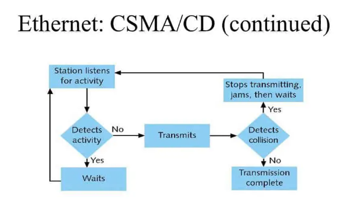

## What is CSMA/CD

> CSMA(Carrier Sense Multiple Acess) / CD(Collision Detection)

이더넷에서 네트워크에 참여하는 장치가 접속하는 것을 관리하는 방법 중 하나이다.

### CSMA/CD Process

컴퓨터 2대 A, B가 있다고 하자.

여기서 A, B 컴퓨터가 다른 컴퓨터를 향해 스위치를 통해서 정보를 요청한다고 해보자.

1. A, B 컴퓨터는 서버에 정보를 전송하기 위해 회선이 사용 중인지 아닌지 확인한다. (반송파 감지 - Carrier Sense, 또는 청취)

2. 양 컴퓨터는 회선이 사용중이지 않다는 것을 확인하고 두 컴퓨터가 서버로 정보를 요청한다. (다중 접근 - Multi Access)

3. 두 컴퓨터의 통신이 충돌(Collision), 신호가 퍼져나갈 때 비정상적인 증폭으로 충돌을 확인한다. (충돌 감지 - Collision Detection)

4. 충돌을 확인한 전송장비가 충돌을 알린다. (충돌 신호 - Jam Signal)

5. A, B 컴퓨터는 충돌을 확인한 후 백오프(Backoff) 알고리즘을 수행하고, 임의의 시간동안 전송을 중단한다.

6. 임의의 시간이 지난 후, 다시 청취 모드로 돌아가 이 과정을 충돌이 일어나지 않을 때까지 반복한다.

### 현재 적용 상황

Network Hub라는 것이 등장하여, 네트워크 형태가 Bus형에서 Star형으로 변경되고, Hub가 업그레이드 되어 'Switching Hub' 또는 'L2 Switch'로 변경됨에 따라 현재는 이더넷에서 실질적으로 충돌 자체가 발생하지 않는 구조로 변경되었다.

LAN cable이라고 불리는 RJ-45 연결단자를 사용하는 21세기 이더넷은 이런 충돌 자체가 근복적으로 생기지 않도록 변경되었기에 현재 10Mbps, 100Mbps 이상의 기가 인터넷이 가정집에 보급되는 세상이 되었다.

현재는 충돌이 발생하지는 않지만, 과거의 이더넷과의 호환성을 위해 CSMA/CD는 이더넷 표준에 포함되어 있다.
