## How the Ethernet protocol Works

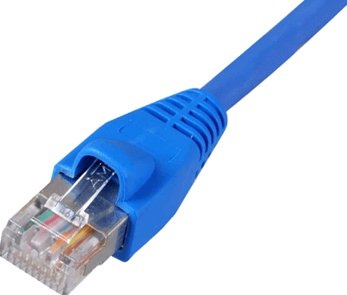

<BR>
<BR>
<BR>
<BR>

### Ethernet Frame Overview

> Ethernet Frame format은 아래와 같다.

<BR>
<BR>

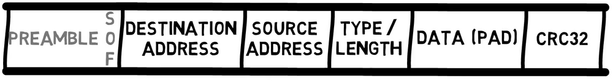

#### Frame 이전 Date - Preamble (8bytes)

<BR>

**Preamable**은 8Bytes로 구성되어 있고, bit pattern은 `1`과 `0`이 교차하는 형태이다. `10101010`과 같이 말이다.

**Ethernet II**에서는 모든 8바이트가 이 패턴을 가진다. 그러나 802.3에서는 첫 7바이트가 `10101010` 값을 가지지만, 마지막 바이트의 마지막 비트는 1로 설정되어 있어, 해당 바이트는 `10101011` 값을 가진다.

이 마지막 바이트는 **Start of Frame(프레임의 시작)**이라고 불립니다. 마지막 두 개의 1 비트는 수신기에게 나머지 프레임이 곧 시작될 것임을 알린다.

새로운 프레임을 전송하기 전에 이 비트 패턴을 보내면 네트워크의 장치들이 수신기 클록을 쉽게 동기화할 수 있다. **Preamble**은 실제 프레임의 일부가 아니며, 단지 각 프레임에 앞서 전송되기 때문에, 이더넷 프로토콜의 많은 다이어그램에서는 **Preabmle**을 볼 수 없다.

<BR>

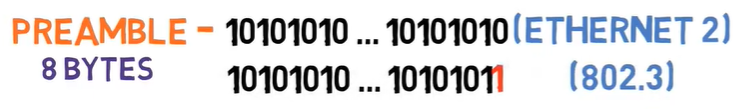

<BR>

#### Destination Address와 Source Address (각각 6bytes)

<BR>

다음으로, 각각 6바이트로 구성된 두 개의 주소가 있다. Ethernet 주소에 대해서는 나중에 더 자세히 설명하겠지만, 지금은 프레임이 목적지 주소로 시작하고, 그 다음에 출발지 주소가 온다는 점을 주목해보자.

왜 프레임이 목적지 주소로 시작할까? 그 이유가 있을까?

물론 있다. 장치가 수신한 프레임을 가장 먼저 할 일은 이 프레임이 자신에게 향한 것인지 아닌지를 확인하는 것이다. 만약 이 프레임이 해당 장치로 향한 것이 아니라면, 단순히 폐기될 수 있다. 따라서 목적지 주소가 먼저 온다.

출발지 주소는 왜 중요할까? 필요시 수신자가 응답을 보내야 할 대상이 누구인지 알기 위해서이다. 이 출발지 주소는 일부 네트워크 장치가 구현되는 방식에서도 중요한 역할을 한다. 이에 대해서는 앞으로의 글에서 더 자세히 다루겠다.

<BR>

#### Type / Length field - Ethernet 2 (Type) (2bytes)

<BR>

다음으로 다소 문제가 있는 필드인 Type 또는 Length 필드가 온다.

**Ethernet 2**에서는 이 필드를 Type이라고 하며, 이 프레임이 어떤 페이로드를 가지고 있는지를 수신기에게 알려준다.

예를 들어, 이 프레임이 IP 레이어(즉, 이더넷 레이어의 데이터가 IP 패킷임)를 가지고 있다면, 수신 네트워크 카드는 프레임의 페이로드를 IP 핸들러에게 전달해야 한다. 만약 프레임의 페이로드가 ARP라면, ARP 핸들러가 이를 처리해야 한다.

여기서 핸들러란 이 프로토콜을 처리하는 코드, 예를 들어 ARP를 파싱하는 코드를 의미한다.

IEEE 802.3에서 Length의 필요성과 이를 어떻게 처리하는지에 대해서는 곧 다시 다루겠다.

<BR>

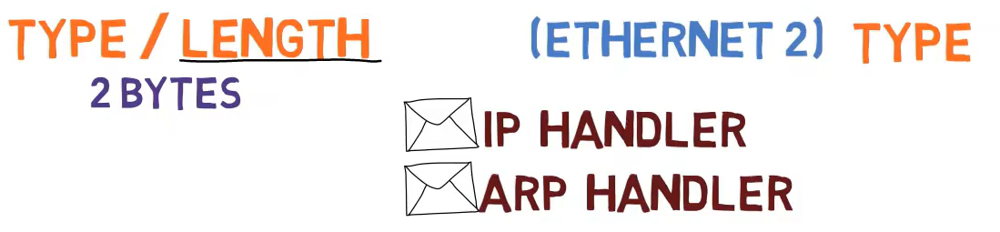

<BR>

#### Data 그리고 Pad (46 - 1500bytes)

<BR>

이 필드 다음에는 최대 1500바이트의 데이터가 온다. 이 숫자는 1978년 당시 RAM이 비쌌기 때문에 선택된 것이다. 만약 프레임이 더 컸다면 수신기에 더 많은 RAM이 필요했을 것이다.

이는 즉, 3계층이 이더넷을 통해 1500바이트 이상의 데이터를 전송하고자 할 경우, 여러 프레임에 걸쳐 전송해야 함을 의미한다.

또한 최소 데이터 길이는 46바이트이다. 프레임의 다른 필드와 함께, 이더넷 프레임의 최소 길이는 총 64바이트이다.

왜 최소 프레임 길이가 필요할까? 이에 대해서는 다음 섹션에서 논의하겠다.

현재로서는 이더넷 프레임에 최소 길이가 있다는 점에서, 만약 송신자가 아주 짧은 메시지, 예를 들어 단 1바이트만 전송하고자 한다면 어떻게 될까?

그 경우, 송신자는 메시지를 최소 길이에 도달할 때까지 예를 들어 `0`으로 채워야 한다. 예를 들어, 송신자가 단 1바이트의 데이터, 예를 들어 문자 `A`를 전송하고자 할 경우, 45바이트의 `0`을 추가해야 한다.

<BR>


<BR>

#### Checksum - CRC32 (4bytes)

<BR>

마지막으로 **Checksum**이 있다. 이는 32비트 CRC **Checksum**으로, 프레임의 비트가 올바르게 수신되었는지 여부를 확인하는 데 사용된다. 오류가 발생한 경우, 프레임은 폐기된다.

CRC는 전체 프레임, 즉 헤더를 포함한 모든 부분에 대해 계산된다. **Preamble**은 실제 프레임의 일부가 아니기 때문에 포함되지 않는다.

**Checksum**으로 CRC-32를 사용할 때, 데이터 길이에 관계없이 고정된 오버헤드인 32비트, 즉 4바이트가 설정된다. 다시 말해, 단 1바이트의 데이터를 전송하더라도 32비트 **Checksum**을 받고, 천 바이트의 데이터를 전송하더라도 32비트 **Checksum**을 받는다.

<BR>

#### Type / Length Filed에 대한 문제들

<BR>

앞서 데이터 필드는 최소 46바이트여야 하며, 그렇지 않으면 패딩을 해야 한다고 언급했다. 간단하게 `0`으로 패딩한다고 가정해보자, 이는 표준에 따른 것이다.

그런데 실제로 여기서 문제가 발생한다.

예를 들어, 송신자가 문자 `A`로 구성된 단일 바이트를 전송하고자 한다고 가정해보자. 그러면 `A` 다음에 45개의 `0`을 전송하게 된다.

만약 송신자가 `A`와 `0`을 전송하고자 한다면 어떻게 될까? 즉, 데이터가 실제로 `A0`로 구성된 경우이다. 이 경우에도 `A` 다음에 45개의 `0`을 전송하게 된다. 그러나 이번에는 첫 번째 `0`이 패딩이 아니라 실제 데이터의 일부이다.

이렇게 되면 데이터와 패딩을 구분하는 데 혼란이 생길 수 있다.

<BR>

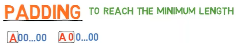

<BR>

수신자로서, 짧은 프레임의 경우 패딩 바이트와 실제 데이터 바이트를 구분할 방법이 필요하다.

Ethernet 2는 이 문제를 다루지 않았다. 즉, Layer 3은 데이터와 패딩을 함께 받게 된다. 예를 들어, `A`와 45개의 `0`을 받게 되며, Layer 3가 어느 바이트가 데이터이고 어느 바이트가 패딩인지 스스로 판단해야 한다.

물론, Layer 3에 길이 필드가 포함되어 있다면 이는 가능하다. 하지만 이 해결책은 그다지 우아하지 않다. 왜냐하면 Layer 3이 Layer 2에서 처리해야 할 패딩 문제를 처리해야 하기 때문이다.

이것은 명백히 계층 모델을 위반하는 것이다

이러한 이유로, IEEE는 IEEE 802.3에서 Type 필드를 Length 필드로 변경했다. 예를 들어, `A`라는 단일 바이트의 데이터를 포함하는 프레임은 Length 필드를 `1`로 설정하고, `A0`라는 두 바이트의 데이터를 포함하는 프레임은 Length 필드를 `2`로 설정하다.

<BR>

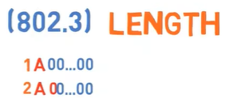

<BR>

이것은 멋진 해결책이지만, 이제 두 가지 문제가 발생한다:

첫째, Ethernet 프레임을 수신했을 때 이 필드가 Type을 의미하는 Ethernet 2 프레임인지, 길이를 의미하는 IEEE 802.3 프레임인지 어떻게 알 수 있을까?

둘째, Type 필드는 어떻게 되는 걸까? 수신기가 프레임 내에 어떤 프로토콜이 있는지 어떻게 알 수 있을까?

첫 번째 질문부터 시작해 봅자. IEEE 802.3가 발표되었을 때 이미 많은 이더넷 카드가 사용되고 있었다. 사람들은 단지 새로운 표준이 발표되었다고 해서 네트워크 카드를 교체하고 싶어하지 않았다.

생각해보자, 당신은 새로운 네트워크 카드를 사고 싶어할까? 아니면 프로그래머가 아닌 친구들이 "인터넷 전문가"들이 "새로운 표준"을 결정했다며 새로운 카드를 사야 한다고 하면 그들이 카드를 교체할까?

해결책은 Ethernet 2와 IEEE 802.3가 동일 네트워크에서 함께 작동할 수 있도록 하는 것이다.

다행히도 당시 사용된 모든 Type 값은 `1500`보다 큰 값을 가지고 있다. 해결책은 따라서 간단하다. 이 필드의 값이 `1500` 이하인 경우, 이는 실제로 길이를 의미한다. 값이 `1536` 이상인 경우, 이는 Type을 의미한다. 그 사이의 값들은 현재 아무 의미도 없다.

<BR>

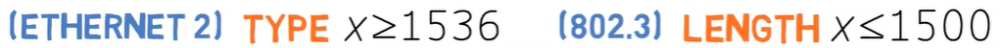

<BR>

예를 들어, 이 필드의 값이 `400`인 프레임을 본다면, 이는 `400`바이트 길이의 IEEE 802.3 프레임이라는 것이 명확하다.

이제 직접 해보자: 이 필드가 `20`으로 설정된 프레임을 본다면, 이는 Ethernet 2 프레임일까, IEEE 802.3 프레임일까?

맞다, 이는 `20`바이트의 데이터를 가지는 IEEE 802.3 프레임이다. 따라서 `26`바이트의 패딩이 포함된다. 그렇다면 이 필드가 `2000`으로 설정된 프레임을 본다면 어떨까?

이 경우, 이는 Ethernet2 프레임이라는 것을 알 수 있으며, `2000`은 Type 값을 의미한다.

이것이 우리가 Ethernet2 프레임인지 IEEE 802.3 프레임인지 구분하는 방법이다.

다음으로, IEEE 802.3 프레임이 어떻게 Type 정보를 포함하는지 알아보자. 즉, IEEE 802.3가 Type 필드를 덮어썼기 때문에, 수신자가 들어오는 프레임을 어떻게 처리해야 할지 알 방법이 없었다. 따라서, IEEE 802.3는 데이터 바로 앞에 802.2 LLC(Logical Link Control) 프로토콜의 또 다른 헤더를 추가한다. 이 헤더가 Type 정보를 전달한다.

그래서 IEEE 802.3 프레임은 목적지 주소 필드, 출발지 주소 필드, 길이 필드, LLC 헤더, 데이터, 체크섬 순으로 구성된다.

<BR>

##### 잠깐 생각해보면, IEEE 802.3은 1983년에 발표되었다. 그런데 무슨 문제가 있었던걸까

<BR>

앞서 언급한 대로, 1978년에는 Ethernet2가 발표되었다. 그리고 그 후 얼마 지나지 않아 1983년에 새로운 형식이 나왔다. 그러나 그 저자들은 하위 호환성을 허용했는데, 아마도 몇 년 안에 모든 장치가 새로운 표준으로 업그레이드될 것으로 생각했을 것이다.

하지만 그들은 틀렸다.

당신의 네트워크를 확인해보면 (Ethernet에 연결되어 있다면), Ethernet2 프레임을 볼 수 있을 것이다.

당신의 장치는 아마도 두 버전 모두를 지원하지만, 기본적으로 802.3 대신 Ethernet2 프레임을 전송할 것이다. 왜냐하면 Ethernet 네트워크에 연결된 모든 장치가 Ethernet2 프레임을 읽을 수 있음이 보장되지만, 802.3 프레임을 읽을 수 있는 것은 보장되지 않기 때문이다.

모든 Layer 3 프로토콜은 데이터와 패딩을 구별하는 문제를 고려해야 했다. 그렇다면 모든 프로토콜이 이미 이 문제를 다루고 있다면, 하위 호환성을 굳이 고려할 필요가 있었을까 생각했겠지만, 어쨋든 이 문제는 Layer 2에서 해결해야만 했다.

개별 장치 (예: 개인 컴퓨터)는 거의 항상 Ethernet2를 통해 통신한다. IEEE 802.3도 마찬가지로 매우 흔하며, 현대의 대부분의 네트워크 장치 (예: 스위치)에서는 기본적으로 사용된다.

이 이야기는 실제로 아주 중요한 교훈을 포함하고 있는데 바로 후속적으로 프로토콜을 교체하는 것은 매우 어렵다는 것이다. 특히 하드웨어 장치 (예: 네트워크 카드)에 구현된 경우 더욱 그렇다.

위의 내용을 간략하게 정리하면 아래와 같이 볼 수 있다.

1. **기존 인프라와의 호환성:** 많은 기업과 사용자들이 이미 Ethernet2 기반의 네트워크 장비를 사용하고 있었기 때문에, 새로운 표준인 IEEE 802.3가 도입되더라도 기존 장비를 즉시 교체하기 어려웠다. 따라서 IEEE 802.3는 Ethernet2와 동일한 네트워크에서 공존할 수 있어야 했다.

2. **네트워크 업그레이드 비용 절감:** 새로운 표준이 발표될 때마다 모든 장비를 교체하는 것은 비용이 많이 드는 일이므로, 기존 장비를 계속 사용할 수 있도록 하는 것이 경제적이었다.

3. **기술 발전의 연속성:** Ethernet2와 IEEE 802.3 간의 호환성을 유지함으로써 네트워크 기술의 발전이 지속적으로 이루어질 수 있었다. 새로운 표준이 기존 표준을 완전히 대체하는 대신, 점진적으로 통합되고 개선될 수 있었다.

<BR>

##### Inerpacket Gap이 뭘까?

<BR>

이더넷 프레임이 전송된 후, 송신기는 수신기가 프레임 전송이 끝났음을 알 수 있도록 다음 프레임을 전송하기 전에 매우 짧은 시간을 대기한다. 프레임 간의 이 유휴 시간을 `Interpacket gap`이라고 한다.

<BR>

### Ethernet Address는 어떻게 동작할까?

<BR>

모든 이더넷 프레임은 두 개의 주소를 포함한다. 첫 번째는 목적지 주소이고, 두 번째는 출발지 주소이다. 우리는 수신기가 프레임이 자신과 관련이 있는지 알 수 있도록 목적지 주소가 먼저 나타난다고 언급했다. 만약 목적지 주소가 수신기와 같지 않으면, 프레임은 폐기될 것이다.

<BR>

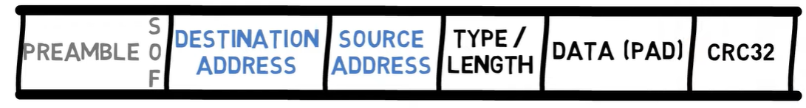

<BR>

이더넷 주소는 어떻게 생겼을까?

이더넷 주소는 6바이트, 즉 48비트로 구성된다. 일반적으로 16진수로 표시되며, 대시나 콜론으로 구분된다. 다음 예시에서 볼 수 있듯이 말이다

<BR>

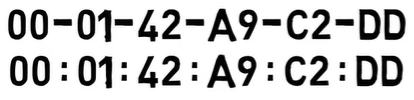

<BR>

```bash
00:01:42:a9:c2:dd
00-01-42-a9-c2-dd
```

이들은 동일한 이더넷 주소의 두 가지 표현 방식이며, 둘 사이에 실제 차이는 없다.

일반적으로, 이더넷 주소는 전 세계적으로 고유해야 한다. 즉, 두 개의 이더넷 장치가 동일한 주소를 가지지 않는다 (적어도 이론적으로는).

모든 주소의 처음 3바이트는
**OUI (Organizationally Unique Identifier)**라고 한다. 주소가 고유하도록 하기 위해, IEEE는 이 OUIs를 Dell, HP 또는 IBM과 같은 다양한 제조업체에 할당한다.

이 주소의 부분은 벤더 ID라고도 한다. 그런 다음, 제조업체는 남은 3바이트를 특정 호스트에 할당한다. 이 부분은 호스트 ID라고도 한다.

가장 중요한 3바이트는 벤더 ID이고, 가장 덜 중요한 3바이트는 호스트 ID이다

<BR>

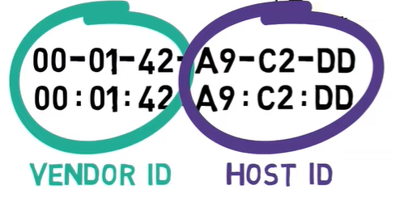

<BR>

예를 들어, OUI `00:01:42`는 `Cisco`에 속한다. 이제 `Cisco`는 네트워크 카드를 제조하고 주소 `00:01:42:00:00:01`을 할당할 수 있다. 다음으로, 또 다른 카드를 제조하고 주소 `00:01:42:00:00:02`를 할당할 수 있다. 이 두 주소는 동일한 벤더 ID를 공유하지만, 다른 호스트 ID를 가진다.

하나의 OUI는 호스트 ID를 위해 3바이트를 남겨두기 때문에, OUI당 `2^24`, 즉 16,777,216개의 호스트 ID가 있다. 물론, 큰 제조업체는 훨씬 더 많은 주소가 필요하며, 따라서 추가적인 OUIs를 할당받는다. 예를 들어, `00:01:64`는 `Cisco`에 속하는 또 다른 OUI이다.

<BR>

#### Unicast와 Multicast Bits

<BR>

이더넷 주소는 두 개의 특수 비트를 포함한다.

첫 번째 특수 비트는 주소가 유니캐스트 주소인지 멀티캐스트 주소인지를 나타낸다. 유니캐스트는 주소가 단일 장치임을 의미한다. 멀티캐스트 주소는 네트워크의 모든 프린터나 동일한 로컬 네트워크의 모든 장치와 같이 장치 그룹을 나타낸다.

주소가 유니캐스트인지 멀티캐스트인지를 나타내는 비트는 가장 중요한 바이트 내에서 가장 덜 중요한 비트이다. 무슨 뜻일까?

다음의 이더넷 주소를 고려해 보자

`06:b2:d9:a2:32:9e`

여기서 가장 중요한 바이트는 `06`이다.

이를 이진수로 변환해 보자

`00000110`

이제 가장 덜 중요한 비트를 보자. 바로 이 `0`이다

<BR>

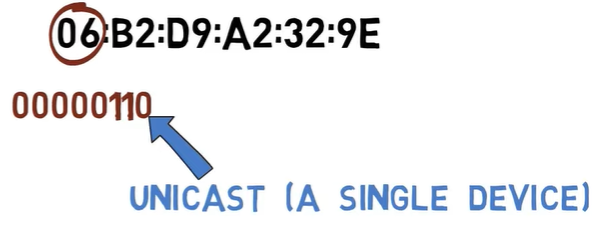

<BR>

이 비트가 꺼져 있다(0이라는 의미). 이는 유니캐스트 주소임을 의미한다. 즉, 이는 컴퓨터의 네트워크 카드와 같은 단일 장치에 속한다는 말이다.

다른 주소를 고려해 보자

`11:c0:ff:ee:d8:ab`

가장 중요한 바이트는 `11`(16진수 기준)이다

이를 이진수로 변환해 보자

`00010001`

<BR>

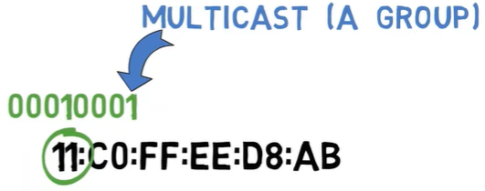

<BR>

가장 덜 중요한 비트는 이 1이다. 이 비트가 켜져 있으므로, 이는 멀티캐스트 주소임을 알 수 있다. 즉, 이는 그룹의 주소이다. 이 주소로 프레임을 보내면, 이 그룹에 속한 모든 장치가 그 프레임을 자신에게 보낸 것으로 간주한다.

매우 유명한 멀티캐스트 주소 중 하나는 브로드캐스트 주소이다. 이는 모든 기계를 포함하는 그룹이다. 이 그룹의 주소는

`FF:FF:FF:FF:FF:FF`

즉, 모든 비트가 켜진 주소이다

모든 기계는 브로드캐스트 그룹의 일부이다

<BR>

#### Globally Unique / Locally Administered Bit

<BR>

두 번째 특수 비트는 주소가 실제로 전역적으로 고유한지 여부를 나타낸다. 이 비트는 가장 중요한 바이트 내에서 두 번째로 덜 중요한 비트이다.

다시 첫 번째 주소를 보자

`06:b2:d9:a2:32:9e`

첫 번째 바이트는 `06`이다.

이진수로 변환하면,

`00000110`

두 번째로 덜 중요한 비트는 여기다

<BR>


<BR>

이 비트가 켜져 있으므로, 이 주소는 실제로 전역적으로 고유하지 않다는 것을 알 수 있다. IEEE는 이 주소를 어떤 벤더에게도 할당하지 않는다. 즉 이것은 임의로 만든 주소이다. 원한다면, 특정 장치에 이 주소를 할당할 수 있다. 이 비트가 켜져 있다는 사실은 이 주소가 전역적으로 고유하지 않음을 선언하는 것이다.

다른 주소를 고려해 보자

`00:01:42:a9:c2:dd`

첫 번째 바이트는 `00`이므로, 두 번째로 덜 중요한 비트는 `0`입니다.

<BR>


<BR>

이것은 Cisco에 할당된 전역적으로 고유한 주소이다.

<BR>

#### Ethernet Addresses - Recap

<BR>

결국, 이더넷 주소는 두 가지 주요 부분을 가지고 있다 - 벤더 ID와 호스트 ID.

또한 두 개의 특수 비트가 있다 - 가장 중요한 바이트 내에서 가장 덜 중요한 비트는 주소가 유니캐스트인지 멀티캐스트인지를 나타낸다.

가장 중요한 바이트 내에서 두 번째로 덜 중요한 비트는 주소가 전역적으로 고유한지를 나타낸다.

<BR>

### 왜 Ethernet Frame은 최소 길이를 가지고 있을까?

<BR>

앞 서 이더넷 프레임이 최소 46바이트의 데이터와 최대 1500바이트의 데이터를 포함한다고 언급했다. 최대 길이에 대해서는 이미 설명했지만, 최소 길이에 대해서는 언급하지 않았다.

논의를 단순화하기 위해, 모든 컴퓨터가 단일 케이블에 연결된 고전 이더넷을 사용하는 네트워크를 생각해 보자.

<BR>

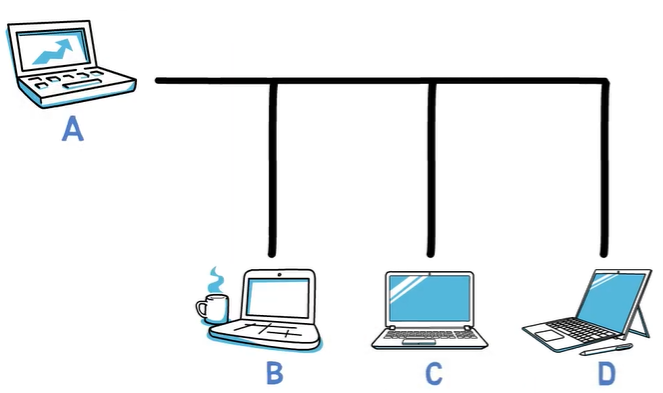

<BR>

A가 B에게 메시지를 보내고 싶어하고, C가 D에게 메시지를 보내고 싶어한다고 가정해 보자. A가 프레임을 전송하는 동안 C도 프레임을 전송하고 있다고 가정하자. 이 경우, 프레임들이 충돌할 것이다.

<BR>

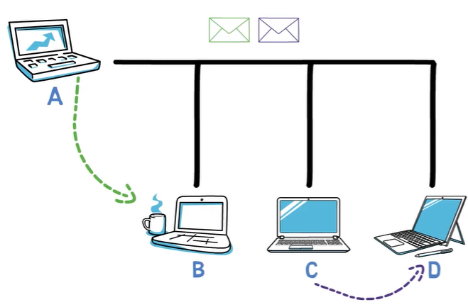

<BR>

즉, 오류가 발생한다. 두 사람이 동시에 말하기 시작할 때처럼, 어느 쪽도 이해할 수가 없다.

<BR>

#### 이더넷에서 충돌을 처리하는 방법

<BR>

이더넷은 충돌을 처리하기 위해 두 가지 주요 메커니즘을 사용한다. 첫 번째는 **CSMA(Carrier Sense Multiple Access)**라고 불린다. 이는 기본적으로 스테이션이 데이터를 전송하고자 할 때, 먼저 채널을 감지하여 다른 누군가가 전송 중인지 확인하는 것을 의미한다. 채널이 사용 중이면, 스테이션은 기다렸다가 다시 시도한다.

그래서, A가 전송 중일 때 C가 데이터를 보내고 싶다면, C는 A가 전송을 마칠 때까지 기다린 후 전송을 시작한다.

이것은 사람 간의 대화에서 한 사람이 말을 멈출 때까지 기다렸다가 그 사람이 말하는 것과 같다.

그러나 두 사람이 동시에 말을 시작할 수 있는 경우처럼, 두 대의 이더넷 기기가 동시에 데이터를 전송하기 시작할 수도 있다. 이 경우, **CD(Collision Detection)**가 작동한다. 충돌 감지는 전송 장치가 충돌이 발생했음을 감지하는 것을 의미한다. 이는 전송 중에 채널을 듣는 방식으로 이루어진다.

예를 들어, A 스테이션이 비트 스트림 `11001010`을 전송한다고 가정하자. 전송하는 동안 A는 또한 채널을 듣는다. 충돌이 발생하지 않으면, A는 채널에서 `11001010` 신호를 읽게 된다.

<BR>

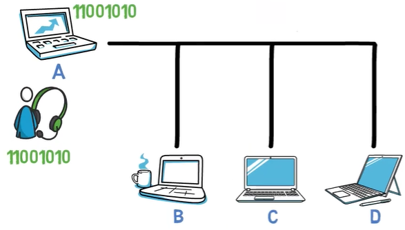

<BR>

충돌이 발생하면, 예를 들어 C가 보낸 프레임과 충돌하면, A는 라인에서 다른 신호를 읽게 된다. 예를 들어, `11011010`을 읽게 된다. 이렇게 해서 A 기기는 자신의 프레임이 충돌했음을 알게 된다.

<BR>

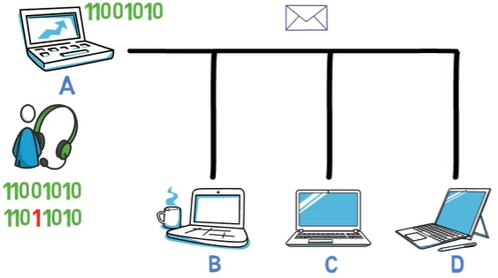

<BR>

A 기기는 프레임 전송을 완료하기 전에 충돌이 발생했음을 알 수 있다. 그런 다음 A 기기는 전송을 중지하고 충돌이 발생했음을 다른 스테이션에 알리기 위해 JAM 신호를 발신한다. 결과적으로 두 스테이션은 전송을 중지하고 무작위 시간 간격 동안 기다린 후 다시 전송을 시도힌다.

네트워크에서 충돌 횟수가 증가할수록 스테이션이 기다리는 시간도 증가한다. 첫 번째 충돌 시, A와 C는 비교적 짧은 시간 동안 기다린 후 다시 전송한다. 또 다른 충돌이 발생하면 더 오래 기다릴 수 있다.

<BR>

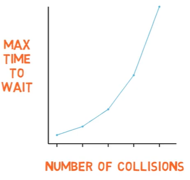

<BR>

이제 이더넷으로 돌아가자. 이더넷에서는 유효한 프레임이 목적지 주소에서 체크섬까지 최소 64바이트 길이여야 한다. 따라서 데이터는 최소 46바이트 길이여야 한다. 프레임이 너무 짧으면 패딩을 해야 한다.

<BR>

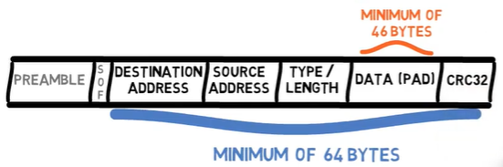

<BR>

최소 길이를 두는 이유 중 하나는 앞서 설명한 충돌 감지 메커니즘과 직접적으로 관련이 있다.

다음 시나리오를 고려해 보자. 호스트 A가 B에게 매우 짧은 프레임을 보내고 싶어한다고 가정해 보자. 프레임이 1바이트 길이밖에 안 된다고 가정하자. 물론 이더넷에서는 이런 일이 발생할 수 없지만 설명을 위해 과장된 예를 들겠다.

호스트 A가 이 프레임을 전송한다. 이 프레임은 8개의 `1`로 구성되어 있다. 그런 다음 A는 전송하면서 채널을 듣고, 8개의 `1`을 읽고, 프레임이 성공적으로 전송되었다고 결론지을 것이다.

하지만 프레임이 네트워크의 다른 끝에 도달하기 전에 D가 매우 짧은 프레임을 전송하기 시작한다. 이 프레임은 1바이트 길이로, 8개의 `0`으로 구성되어 있습니다. D는 전송하면서 채널을 듣고, 8개의 `0`을 읽고, 프레임이 성공적으로 전송되었다고 결론지을 것이다.

<BR>

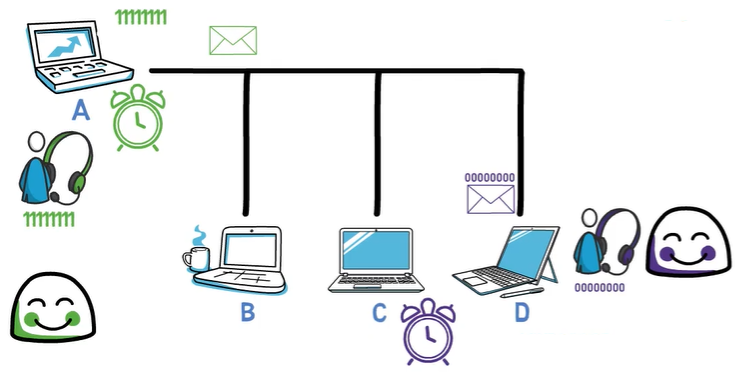

<BR>

이제 이 두 매우 짧은 프레임이 충돌한다. 그러나 A와 D는 모두 프레임이 성공적으로 전송되었다고 결론지었기 때문에 이 충돌을 인식하지 못한다.

이러한 경우를 방지하기 위해, 프레임은 프레임의 첫 번째 비트가 라인의 끝에 도달하기 전에 스테이션이 전송을 완료하지 못하도록 충분히 길어야 한다. 이더넷 프레임의 최소 길이를 두는 것은 이 문제를 해결하기 위함이다.
