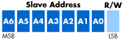

# 1. Prologue

Concept of I2C

## 1.1. Introduce I2C

> I2C 는 Philips Semicondoctors 에서 1982년에 개발된 통신 방식이다.

### 특징


<b> I2C 회로도 구성 (출처 - 위키피디아) </b>

I2C는 동기식, multi-contoller/multi-target(즉 multi master/slave)방식의 시리얼 통신 버스이다.
데이터 통신은 SDA(데이터 신호)와 SCL(클럭 신호) 두 라인을 사용하며, 총 7비트의 통신 주소 공간을 가지며, 7bit address를 사용 시 이론 상 112개의 노드를 동시 연결 할 수 있으며, 10bit address를 사용 시 이론 상 1008개의 노드를 동시에 연결 할 수 있다. 이후 연결 가능한 노드의 개수가 2^n개가 아닌 이유는 통신 방식에서 후술한다.

<table>
  <tr>
    <th> Wires Used </th>
    <td> 2 </td>
  </tr>
  <tr>
    <th> Maximum speed </th>
    <td>  </td>
  </tr>
  <tr>
    <th> Standard mode </th>
    <td> 100kbps </td>
  </tr>
  <tr>
    <th> Fast mode </th>
    <td> 400kbps </td>
  </tr>
  <tr>
    <th> High speed mode </th>
    <td> 3.4Mbps </td>
  </tr>
  <tr>
    <th> Ultra fast mode </th>
    <td> 5Mbps </td>
  </tr>
  <tr>
    <th> Max # of Masters </th>
    <td> Unlimited </td>
  </tr>
  <tr>
    <th> Max # of Slaves (7-bit address)</th>
    <td> 112 </td>
  </tr>
  <tr>
    <th> Max # of Slaves (10-bit address)</th>
    <td> 1008 </td>
  </tr>
</table>

#### I2C 통신 속도 별 모드

- I2C 통신에는 여러 가지 운영 모드가 있으며, 이 모드들은 모두 100 kbit/s의 standard mode를 항상 사용할 수 있도록 호환됨.

- Standard mode : 100 kbit/s 속도로 동작합니다. 모든 I2C 장치가 이 모드를 지원함.
- Fast mode : 몇몇 타이밍 매개변수를 조정하여 400 kbit/s 속도를 달성. I2C 대상 장치에 널리 지원되며, 버스의 용량과 풀업 강도가 허용할 경우 사용할 수 있음.
- Fast mode plus : 더 강력한 (20 mA) 드라이버와 풀업을 사용하여 최대 1 Mbit/s를 달성. 표준 및 패스트 모드 장치(3 mA 풀다운 능력)와의 호환성을 유지하기 위해 풀업의 강도를 줄일 수 있어야 함.
- High speed mode : 3.4 Mbit/s 속도를 달성하며, 고속 전송 중에 활성 풀업이 있는 클록 라인을 컨트롤러가 가지고 있어야 함. 모든 고속 전송은 단일 바이트 "컨트롤러 코드"에 의해 선행되며, 이 코드는 고속 타이밍 모드로의 전환, 빠른 속도나 표준 속도 장치가 전송에 참여하지 않도록 보장해야 하며, 그리고 고속 전송 전에 arbitration이 완료됨을 보장해야 함.
- Ultra Fast mode : 쓰기 전용의 I2C 모드, 5 Mbit/s 전송 속도를 달성하기 위해 항상 데이터 라인을 active 상태로 둠. clock stretching, arbitration, read transfer 및 ACK가 모두 생략됨. 주로 LED 디스플레이에 사용됨.
- Non standard : 일부 제조업체가 최대 1.4 Mbit/s 속도로 제공하는 모드.

### 장/단점

상기의 특성 덕분에 I2C 통신 프로토콜은 아래와 같은 장/단점을 가진다.

#### 장점

- SDA와 SCL 두 가닥의 Data 통신 라인으로 데이터 송수신이 가능함.
- 동기식 통신이므로 비 동기식 통신인 UART 등에 비해 안정적임.
  - 동기식 통신이 더 안정적인 이유는 아래에 후술함.
- BUS 형태로 다수의 I2C Master과 다수의 I2C Slave 장치를 연결할 수 있음. (단 통신 클럭은 1개의 마스터 장치만 제공 가능함.)
  - 이를 통해 1 Master / Mutli Slave를 구성해야 할 경우 Master은 1개의 드라이버만 있어도 됨.

#### 단점

- 속도가 느림 (표준 모드 기준 100kbps) UART 대비 빠르지만 SPI 대비 느리기 때문에 애매한 선택지인 경우가 많음. 그러나 최근 Fast I2C의 경우 최대 5Mbps까지 지원하는 경우도 있음.
- 반이중 통신이기 때문에 한 노드에서 데이터를 보내는 중에는 나머지 노드에서 데이터를 보낼 수 없음.
- 통신 시 데이터 비트의 순서와 구성(제어 레지스터, 디바이스 주소, 전송 플래그 등) 타 통신 방식 대비 다양한 부분을 고려해야 하기 때문에 소스코드 구성이 복잡해질 수 있음.
- Data 통신 라인만 연결해주면 되는 다른 쉬운 통신 방식(CAN 등)에 비해 데이터 통신을 위해 별도의 회로를 구성해야 함. (풀업 저항 구성이 필요함)
  - 풀업 저항에 대한 설명은 아래에 추가함.

상기와 같은 특성으로 인해 I2C는 아래와 같은 응용에서 주로 사용된다.

- 센서류
- OLED, LCD 제어
- DAC 및 ADC 장치 연결
- EEPROM 연결

### 동작 구조

#### Physical Layer

  
I2C Physical Layer (출처 - 위키피디아)

- 피지컬 레이어에서, SCL과 SDA 라인은 오픈 드레인(MOSFET) 혹은 오픈 컬렉터(BJT) 버스 설계로 각 라인마다 풀업 저항이 필요함.
  - 오픈 드레인은 다음과 같은 특성을 가진다.
    - MOSFET (Metal-Oxide-Semiconductor Field-Effect Transistor) 트랜지스터를 사용, MOSFET의 드레인(Drain) 단자가 외부 회로에 연결.
    - 트랜지스터가 활성화(ON)되면 드레인 단자가 접지(GND)에 연결되어 출력이 LOW 상태가 됨.
    - 트랜지스터가 비활성화(OFF)되면 드레인 단자는 고저항 상태가 되어 외부 풀업 저항에 의해 출력이 HIGH 상태가 됨.
    - I2C 버스, GPIO(General Purpose Input/Output) 핀 등에서 사용
    - 낮은 전력 소비, 고속 스위칭이 필요한 경우에 주로 사용
  - 오픈 컬렉터는 다음과 같은 특성을 가진다.
    - 오픈 컬렉터 구성은 BJT (Bipolar Junction Transistor) 트랜지스터를 사용함. BJT의 컬렉터(Collector) 단자가 외부 회로에 연결됨.
    - 트랜지스터가 활성화(ON)되면 컬렉터 단자가 접지(GND)에 연결되어 출력이 LOW 상태가 됨.
    - 트랜지스터가 비활성화(OFF)되면 컬렉터 단자는 고저항 상태가 되어 외부 풀업 저항에 의해 출력이 HIGH 상태가 됨.
    - TTL (Transistor-Transistor Logic) 회로, 릴레이 제어 등에서 사용
    - 비교적 높은 전류를 필요로 하는 경우에 주로 사용
  - 즉 기본적으로 오픈 드레인 및 오픈 컬렉터는 동일하게 default High, active low 방식으로 작동하며, 저전력, high baudrate 혹은 고전력, low baudrate 가 요구되는 응용에 따라 MOSFET 혹은 BJT 트랜지스터를 사용하냐에 따라 특성이 달라짐.
- Low는 Ground, High은 Floating하게(풀업 저항으로 인하여 High로) 하여 제엏 할 수 있음. (즉 직접적인 High 출력을 수행하지 않음) 이를 통해 낮은 전류로도 신호를 제어할 수 있음.
- 그러나 고속 통신을 할 경우, 빠른 rising edge를 생성하기 위해 풀-업 저항 대신 직접 전류를 인가하여 SCL 혹은 SCL과 SDA를 제어할 수 있음.
- 이렇게 Default high로 제어할 경우 여러 노드가 동시에 라인을 제어할 수 있다는 장점이 있음.
  
  
start stop comm (출처 - Analog Device)

- 편의를 위해 해당 단락에서는 데이터 송신자를 Master, 수신자를 Slave라고 정의함.
- No communication 상태일 경우 SCL과 SDA는 모두 High로 유지됨.
- 통신을 시작하기 위해서는 SDA를 Low로 바꾸면서 SCL은 High로 유지한 후 SCL을 Low로 천이 해야함.(SCL이 High인 동안 다시 SDA가 High로 가는 경우는 없음.)
- 동일하게 통신을 정지시키기 위해서는 SCL은 High로 유지한 후 SDA를 High로 천이해야 함.(SCL이 High인 동안 다시 SDA가 Low로 가는 경우는 없음.)
- 데이터 전송 중에는 SDA는 SCL이 Low일때만 천이되어야 함, SCL이 low인 동안 마스터의 SDA 출력은 해당 시점의 비트 데이터를 High나 Low로 결정함.
- 이후 마스터 컨트롤러는 SCL이 High가 되는 시점을 기다림, SCL 신호의 유효한 상승 시점은 Capacitor 혹은 Slave 장치의 clock stretching 여부에 따라 달라질 수 있음.
- SCL이 High가 된후 마스터 컨트롤러는 Slave가 비트 신호를 확인한 것을 확인하기 위해 일정 시간 (약 4us 수준)을 기다린 후 다시 Low로 천이함. 만약 clock stretching이 이뤄진다면 High로 천이하지 않았기 때문에 이 단계가 이뤄질 수 없음.
- 이때 I2C 드라이버 설정에 따라 SCL이 반대로 이뤄지는 경우도 있음.

  
clock stretching (출처 - Microchip)

- 만약 데이터를 수신하는 측이 처리 속도 느리거나 다른 이유로 데이터 수신을 멈추게 해야 할 경우 Clock Stretching이라는 기법을 통해 데이터를 수신하는 I2C 디바이스는  SDA 데이터 송신을 멈추게 할 수 있음.
- Clock Stretching은 Slave에서 SCL 라인을 Low로 유지하여 데이터를 송신하는 Master측에서 데이터를 보내는것을 일시적으로 중단하게 할 수 있음.
- 8비트의 데이터를 송신한 후, 마스터는 슬레이브의 ACK 비트를 기다림, (마스터와 슬레이브의 데이터 방향이 바뀜) 이때 송신이 정상적으로 완료되면 slave는 0(ACK)을, 데이터 수신이 정상적으로 이뤄지지 않았다면 1(NACK)을 보냄. NACK는 다음과 같은 경우에 송신됨.
- Master가 Slave에게 보내는 경우
  - 데이터를 수신할 수 없거나, 해당 데이터 명령을 이해할 수 없거나, 더이상 데이터를 받을 수 없을 경우.
- Slave가 Master에게 데이터를 보내는 경우
  - 데이터 전송을 해당 바이트(8bit) 이후로 정지하고 싶을 경우.
- ACK NACK를 보내는 경우에만 SDA방향이 바뀌고 SCL은 여전히 Master가 제어함.
- ACK를 수신하면, 다시 Master은 세가지 동작 중 하나를 선택할 수 있음.
  - 정지 신호를 보냄, SDA를 Low로 한 후 SCL을 High로 천이한 후에 SDA를 High로 보냄.
  - 다른 데이터 바이트를 전송함, 마스터가 SDA를 set하고 controller가 SCL을 High 로 천이함.
  - Repeated start, SDA를 High로 천이하고, SCL을 High로 가게 한 후 SDA를 다시 Low로 보냄. 이렇게 할 경우 버스 릴리즈를 하지 않고 새 I2C 메세지를 전송할 수 있음.

  
SDA Arbitartion (출처 - [digilent])

- 여러개의 I2C 디바이스가 하나의 버스에 연결되어 있을 경우 arbitration은 모든 컨트롤러가 버스의 정지 및 시작 비트를 모니터링하고 다른 컨트롤러가 버스를 사용 중일 때 메세지를 시작하지 않도록 하는 메커니즘임.
- 그러나 두 컨트롤러가 거의 동시에 전송을 시작할 수 있으며, 이 경우 arbitration이 발생함.
- 이 경우 각 컨트롤러는 SDA의 예상되는 현재 전압 레벨을 확인하여 예상값과 비교함. 이때 예상값과 다른 컨트롤러는 우선순위가 더 낮게 됨.
- 만약 두 컨트롤러가 서로 다른 컨트롤러에게 메세지를 보내는 경우, 더 낮은 타겟 주소를 보내는 컨트롤러가 address 데이터를 보내는 단계에서 더 높은 우선순위를 갖게 됨.
- SMbus나 PMbus의 경우 추가적인 arbitration 로직이 존재함.
  - SMBus는 시스템 관리 작업을 수행하기 위해 I2C 프로토콜을 기반으로 한 통신 버스. 주로 컴퓨터 시스템의 다양한 관리 기능을 지원하기 위해 사용하며 1995년에 Intel이 정의한 표준임.
  - PMbus는 전력 관리 작업을 수행하기 위해 I2C 및 SMBus 프로토콜을 기반으로 한 통신 버스이며 2005년에 PMBus협회에 의해 정의된 표준.
  - 상기 두 버스는 각자의 목적에 따라 I2C를 기반으로 기능이과 요구사항이 추가되어, 기본 I2C arbitration 로직을 따르면서, 타이밍 및 응답 시간 제한과 패킷 에러 체크 로직이 추가된다.
- 이를 통해 I2C는 데이터 전송 중에 다수의 컨트롤러가 동시에 통신을 시도할 경우 arbitration 메커니즘을 사용하여 효과적으로 충돌을 방지하고 통신의 정확성을 보장할 수 있음.

#### 기본 통신 방식

  
I2C 통신 타이밍 (출처 - 위키피디아)

1. 우선 HW상 SDA와 SCL 모두 Rp(풀업 저항)을 이용해 Vdd(Vcc)에 연결하여 SDA SCL 회로를 High로 유지하도록 한다.(플로팅 방지)
2. SCL을 제공하는 마스터는 데이터를 전송할지 수신할지 결정한다. 이때 데이터를 송/수신할 때 반드시 슬레이브 주소를 마스터가 가지고 있어야 한다.
3. SDA와 SCL은 기본적으로 풀업저항에 의해 High 상태를 유지한다.
4. SDA가 low로 떨어지는 신호를 시작 신호 (S) 라고 판단 한다.
5. 이후 파란색 부분처럼 SCL이 Low로 떨어지는 시점이 SDA가 Bit 신호를 전환하는 시점이다.
6. 이후 SCL이 High가 되는 시점에 SDA의 High & Low 여부에 따라 데이터비트가 결정된다.
7. 모든 데이터를 수신한 후 SCL이 High로 유지된 후 SDA가 High로 변환되면 정지 신호로 판단하여 통신을 종료한다.

  
Master Slave 간 통신 시퀀스 (출처 - Digikey)

#### Master to Slave (Write to Slave)

1. Master가 Slave에 데이터를 Write할 경우 시작 신호 S 이후 7비트의 Slave 주소를 Write 한다.
2. 이후 마지막 8번째 비트에 0을 Write한다.(마지막 bit가 0일 경우 Write 모드)
3. 이후 Slave가 데이터 수신을 할 준비가 완료되었다는 신호로 ACK 신호 (0)을 송신하면 Master은 8비트의 데이터를 송신하기 시작한다.
4. 매 8비트마다 Master로부터 데이터가 송신되면 Slave는 ACK 신호(0)를 보낸다.
5. 이후 데이터 전송이 전부 완료되면 마스터는 SCL을 High로 유지한 후 SDA를 High로 바꾼다.

#### Slave to Master (Read from Slave)

1. Master가 Slave로부터 데이터를 Read 할 경우 시작 신호(S)이후 7비트의 Slave 주소를 Write 한다.
2. 이후 마지막 8번째 비트에 1을 Write 한다(마지막 bit가 1일 경우 Read 모드)
3. 이후 Slave가 ACK 신호 (0)을 송신 후 데이터를 송신한다.
4. 매 8비트마다 Slave로부터 데이터가 송신되면 Master은 ACK 신호(0)를 보낸다.
5. 이후 데이터 전송이 전부 완료되면 마스터는 NACK(1)을 보낸 후 SCL를 Hgih로 유지 한 후 SDA를 High로 바꿈.

#### 디바이스 주소

- 상기 통신 시퀀스에서 제공하는 디바이스 주소는 기본적으로 7bit이며, 최대 10bit의 디바이스 주소를 제공할 수 있다. 이때 연결 가능한 디바이스 노드 수 는 2^n개로 나눠 떨어지지 않는데 아래와 같은 이유로 설명할 수 있다.
&nbsp;

7bit adress 방식 (출처 - totalphase)
&nbsp;
- 7bit 어드레스 방식은 시작 신호 S이후의 7비트를 주소로 사용한다.
- 이때 I2C의 7bit 주소 체계에서는 총 128개의 주소가 가능하지만 아래의 예약 주소로 인해 아래의 112개의 주소값을 사용한다.
  - 제너럴 콜 주소 : 000 0000
  - CBus 주소 : 000 0001
  - 고속 모드에서 사용 : 000 0010 ~ 000 0111
  - 10비트 주소를 위한 예약 주소 : 111 1XXX
- 상기의 16개의 주소가 예약되어 있어 실제로는 112개의 주소만 사용 가능하다.
&nbsp;

10bit adress 방식 (출처 - totalphase)
&nbsp;
- 10bit 어드레스 방식은 시작 신호 이후 10 bit address indicator 이후 2bit 및 ack 이후의 8bit를 주소로 사용한다.
- 이때 I2C의 10bit 주소 체계에서는 총 1024개의 주소가 가능하지만 아래의 예약 주소로 인해 아래의 1008개의 주소값을 사용한다.
  - 제너럴 콜 주소: 0000 0000 00
  - CBUS 주소: 0000 0000 01
  - 미래의 확장을 위해 예약된 주소 0000 0000 10 ~ 0000 0001 11
  - 고속 모드에서 사용: 1111 000X XX
- 상기의 16개의 주소가 예약되어 있어 실제로는 1008개의 주소만 사용 가능하다.

#### 동기/비동기식 통신

동기/비동기식 통신 방식의 차이

```lua
#동기식 통신 방식
클록 신호 (SCL):    ---|_|-|_|-|_|-|_|-|_---
데이터 신호 (SDA):  ---1---0---1---0---1---
#비동기식 통신 방식
데이터 신호 (DATA): ---|Start|1|0|1|0|1|Stop|---
```

- 동기식 통신
  - 송신자와 수신자가 공통의 클록 신호를 사용하여 데이터를 동기화함. 클록 신호는 데이터 전송의 타이밍을 제어하며, 모든 데이터 비트가 클록의 상승 또는 하강 에지에 맞추어 전송됨.
  - 송신자와 수신자가 공유하는 클록 신호가 있으며. 이 클록 신호는 데이터 전송을 동기화하는 데 사용됨.
  - 모든 데이터 비트는 클록 신호의 에지(상승 또는 하강)에 맞춰 전송되고 수신됨
  - 클록 신호가 일정한 주기로 제공되므로, 데이터 전송의 타이밍이 일정하고 예측 가능함.
- 비동기식 통신
  - 송신자와 수신자가 독립적인 클록 신호를 사용하며, 데이터 전송은 시작 비트와 정지 비트를 사용하여 각 데이터 프레임을 동기화함. 클록 신호는 송신자와 수신자 간에 공유되지 않음.
  - 각 데이터 프레임은 스타트 비트(보통 논리 LOW)로 시작하고 스톱 비트(보통 논리 HIGH)로 끝남.
  - 송신자와 수신자는 각자 자신의 클록을 사용하여 데이터를 전송하고 수신함. 송신자의 클록과 수신자의 클록이 정확히 일치하지 않을 수 있음.
  - 각 데이터 비트 사이의 타이밍은 스타트 비트와 스톱 비트에 의해 동기화되며, 일정하지 않을 수 있음.
- 상기 이유들로 인해 클럭 소스를 공유함으로써 각 통신 장치간의 데이터 전송 동기화 타이밍이 정확해지고 baudrate를 정확하게 공유 할 수 있기 때문에 동기식 통신이 비동기식 통신 대비 안정적이라고 할 수 있다.

#### 풀업/다운 저항의 차이와 필요성


(좌) 풀업 저항 (우)풀다운 저항 (출처 - circuitbasics)

- 이때 풀업 저항 구성이 필요하다는 의미에 대해, 간단하게 풀업 저항과 풀다운 저항의 회로 구성과 필요성을 간단하게 설명한다.
- 풀업 저항
  - 신호 라인이 유휴 상태일 때(switch 미연결) 신호 라인을 논리 HIGH 상태로 유지
  - 저항을 전원(Vin)에 연결하고, 저항의 다른 끝을 신호 라인에 연결. 신호 라인의 다른 끝은 입력 또는 출력 장치에 연결
  - 신호 라인이 활성 상태가 아닐 때(입력 장치가 연결되지 않거나 드라이버가 신호를 드라이브하지 않을 때), pull-up 저항은 신호 라인을 Vin 전압으로 끌어올려 논리 HIGH 상태로 유지
  - 신호 라인이 활성 상태일 때(switch 연결)는 드라이버가 신호 라인을 LOW 상태로 드라이브할 수 있음.

- 풀다운 저항
  - 신호 라인이 유휴 상태일 때(switch 미연결) 신호 라인을 논리 Low 상태로 유지
  - 저항을 접지(GND)에 연결하고, 저항의 다른 끝을 신호 라인에 연결. 신호 라인의 다른 끝은 입력 또는 출력 장치에 연결
  - 신호 라인이 활성 상태가 아닐 때(switch 미연결), pull-down 저항은 신호 라인을 GND 전압으로 끌어내려 논리 LOW 상태로 유지
  - 신호 라인이 활성 상태(switch 연결)일 때는 드라이버가 신호 라인을 HIGH 상태로 드라이브할 수 있음.
  
- 상기와 같은 구동 원리를 통해 I2C는 신호 Trigger가 Low이므로 (Idle High) 신호선에 풀업저항 구성이 필수적이다.
